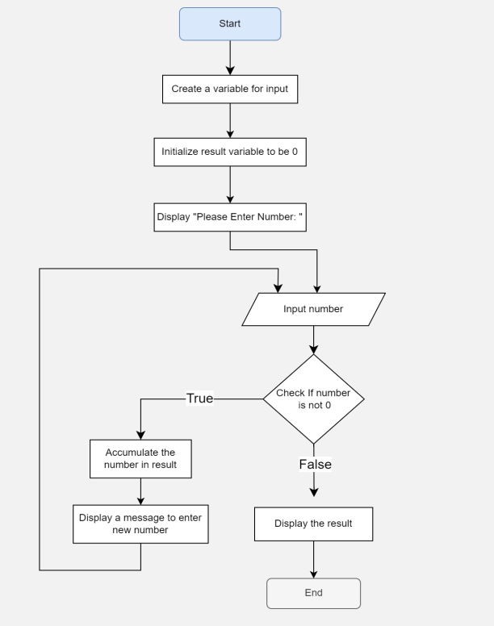
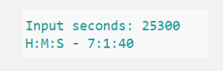
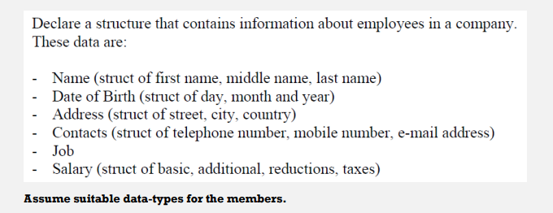

## Q1: Implement the code of the following Flowchart

## Q2: Convert a given integer to hours, minutes, and seconds
- The output should be something like this,

## Q3: Convert Binary Numbers to Decimals and vice-versa
- Ex: 1101 binary → 13 in decimal … 14 in decimal → 1110 in binary

## Q4: City population growth
City has a population of 162,100 … with a population annual growth rate of 6.5%,
Write a program to print the population every year (annual population) till population 
surpass million. And determine how many years would that take.
- Q: Can you determine the number of years it would take for the population to surpass million 
without using loop?

## Q5: Employees Structure

