# Busy Box 
Essential Linux commands and libraries are needed for the target machine's root file system to support a variety of applications.This compilation process generates the executables of the commands, including commonly used utilities.

# install Busy Box
### Steps
1. Download Busy Box

```sh 
git clone https://github.com/mirror/busybox.git
```
2. configure Cross-compiler and target architecture 

```sh 
export CROSS_COMPILE=~/x-tools/arm-cortexa9_neon-linux-musleabihf/bin/arm-cortexa9_neon-linux-musleabihf-

export ARCH=arm 

```
3. Busy box configuration 

```sh 
make menuconfig 
```
- Setting 
    - select Build static binary 
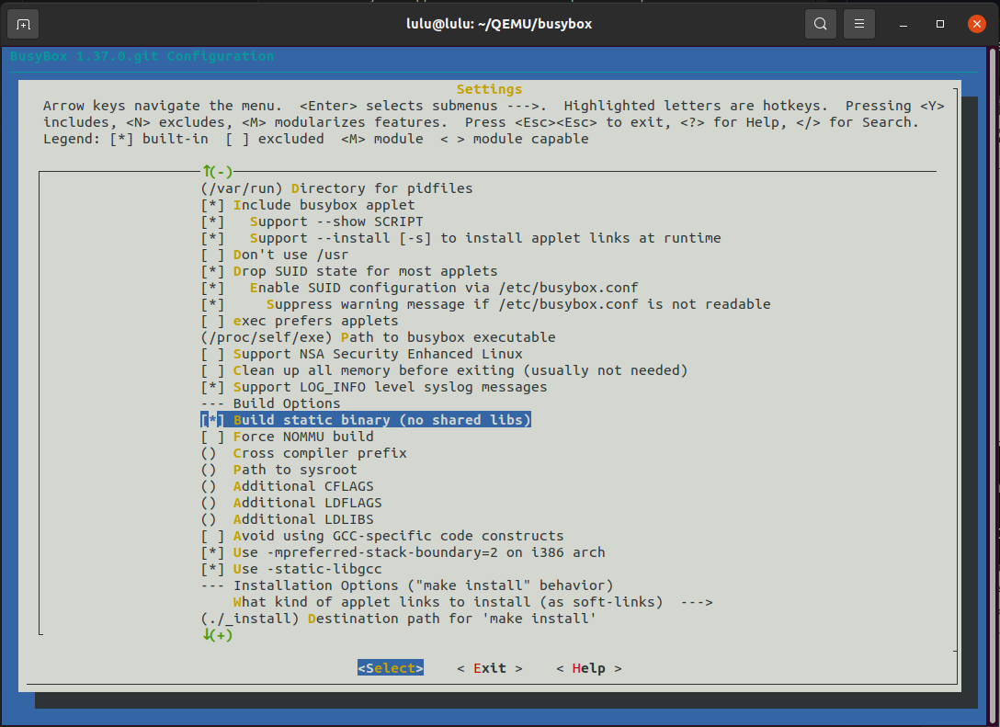


4. Build 

```sh 
make 

```
- check if it is compiled statically 
```sh 
file busybox
```
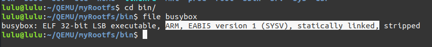

5. Generate Rootfs 

```sh 
make install 

```
created _install directory 
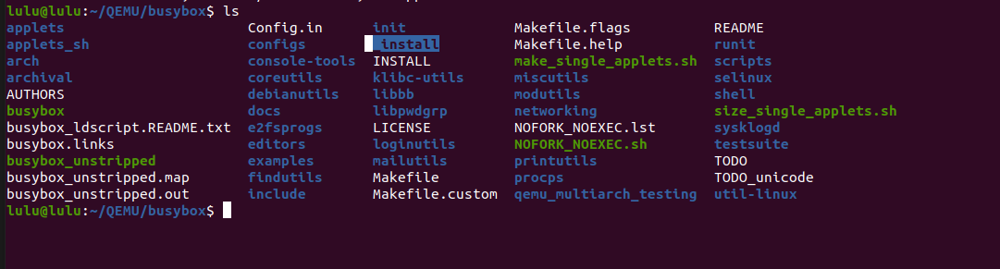
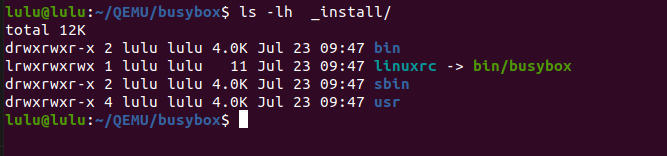

#### create my Rootfs
1. create a directory and copy all content of _install to my directory 
```sh
mkdir myRootfs
rsync -a /_install/* /myRootfs
```

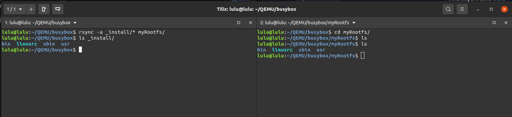

2. create other directories

```sh 
mkdir boot dev etc home mnt proc root srv sys
```
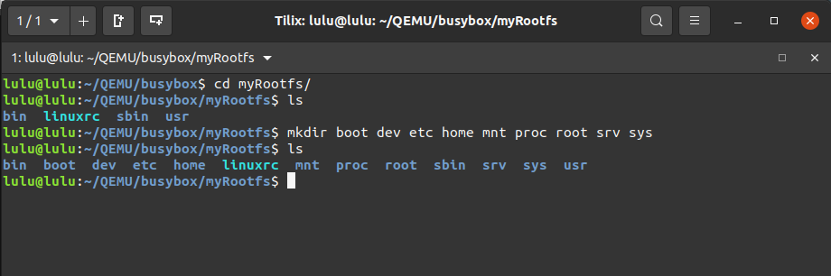

3. create startup file and change the permission 
```sh 
mkdir etc/init.d
touch etc/init.d/rcS
chmod +x etc/init.d/rcS
```
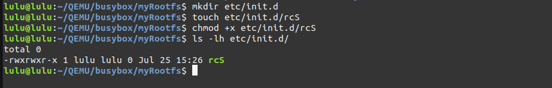

- create configuration file 
```sh 
touch etc/inittap
```

- check owner of myRootfs directory 
```sh 
ls -lh myRootfs
```
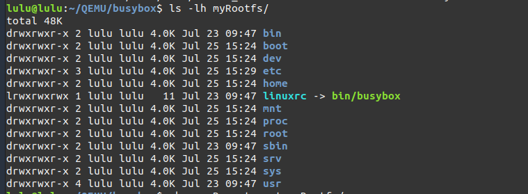

change owner to be root 
```sh 
sudo chown -R root:root myRootfs

```
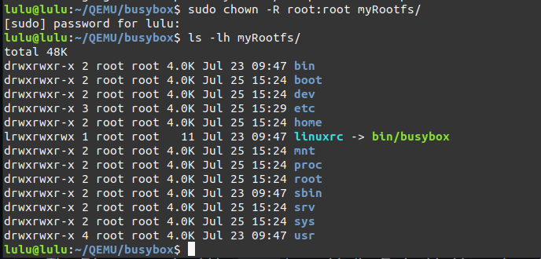

4. write startup file 
```sh
vi etc/init.d/rcs 
```
initialize script to mounts essential filesystems to their respective mount points. 
```sh 
#!/bin/sh
mount -t proc nodev /proc
mount -t sysfs nodev /sys
mount -t devtmpfs devtmpfs /dev
```
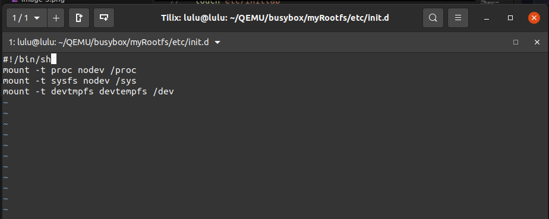
5. write inittab file 
```sh 
vi etc/inittab 

```
```sh
::sysinit:/etc/init.d/rcS
ttyAMA0::askfirst:/bin/sh
::restart:/sbin/init
```
- sysinit: When system startup,what is the file will execute here will execute `rcs` script
- askfirst: ask user first to press any key to do here will open shell on console 
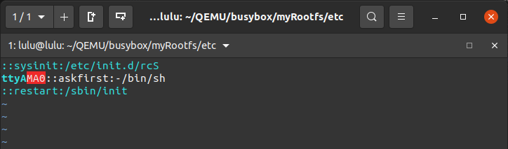


6. copy the content of myRootfs to root partition in our virtual sd card

```sh 
cp -rp myRootfs/* /media/lulu/rootfs/
```
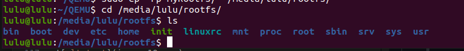

7. make sure ypu copied zImage and vexpress.dtp files to boot partition 

```sh
sudo cp  path/linux/arch/arm/boot/zImage /media/lulu/boot/

sudo cp ~/linux/arch/arm/boot/dts/arm/vexpress-v2p-ca9.dtb /media/lulu/boot
```

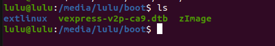

8. Run Qemu 

```sh 
qemu-system-arm -M vexpress-a9 -m 128M -nographic -kernel u-boot -sd ../SD_CARD/lulu.img

```

9. set Environments

```sh
setenv bootargs console=ttyAMA0 root=/dev/mmcblk0p2 rootfstype=ext4 rw rootwait init=/sbin/init
saveenv
```
10. load zImage and vexpress.dtb 

```sh
fatload mmc 0:1 $kernel_addr_r zImage
fatload mmc 0:1 $fdt_addr_r vexpress-v2p-ca9.dtb
```

- check RAM 

```sh 
md $kernel_addr_r
md $fdt_addr_r

```

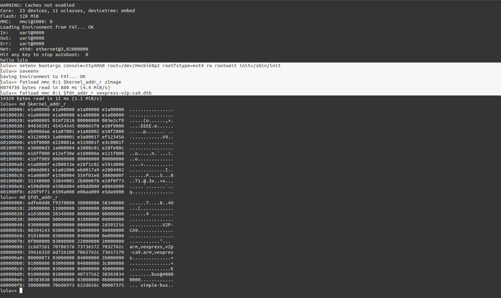


11. Booting the Kernel and dtb file

```sh 

bootz $kernel_addr_r - $fdt_addr_r

```
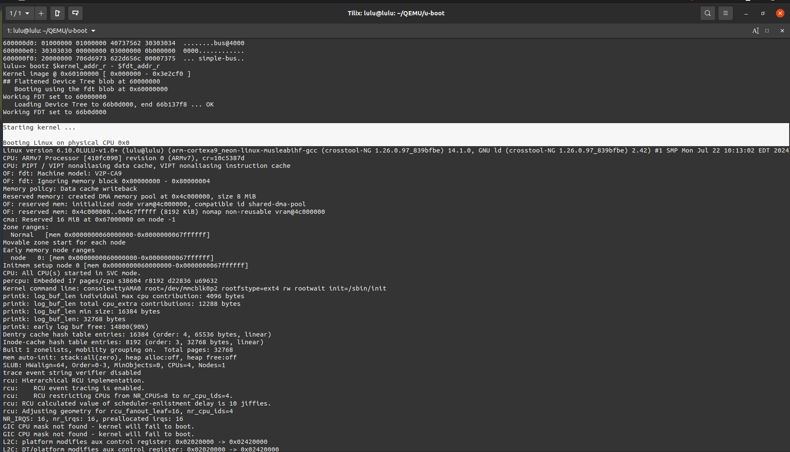

ask you to press Enter to active the code (run shell)
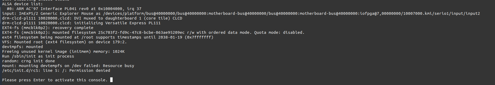

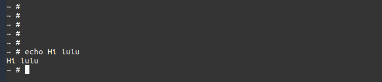