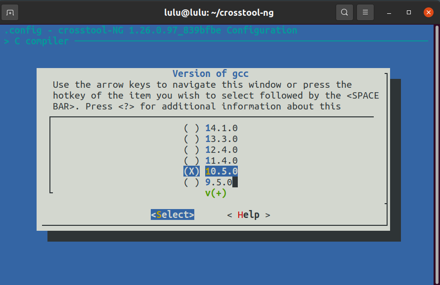
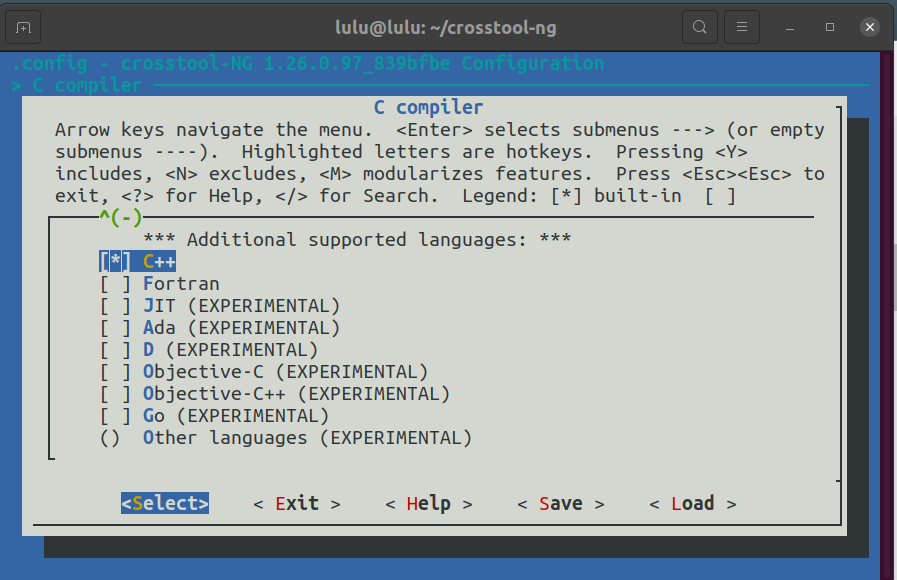
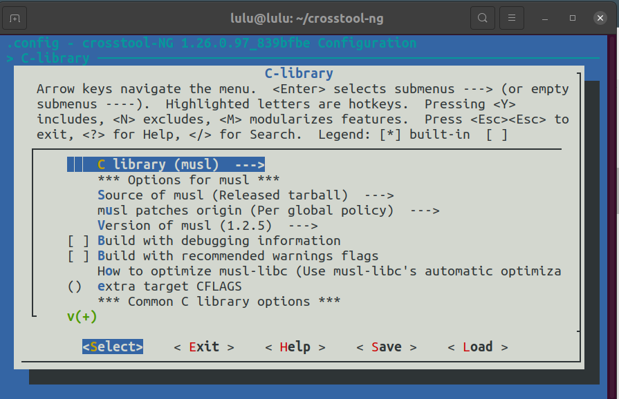
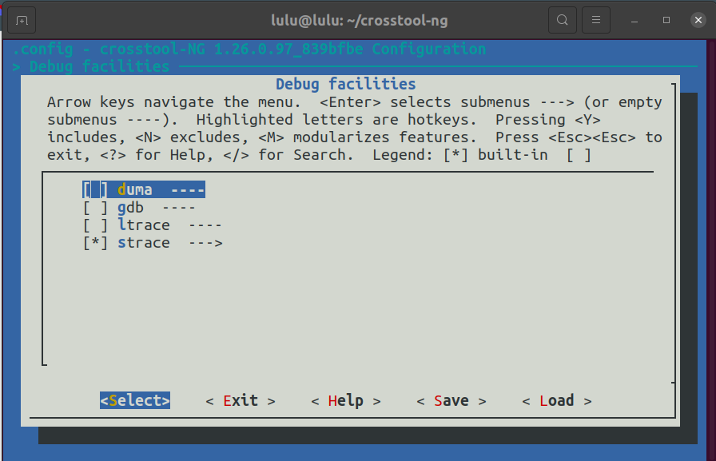
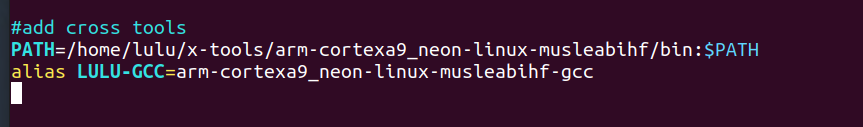
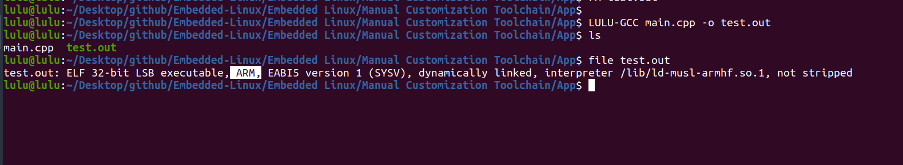

# CrossTool-NG Setup Guide

## Pre-requisites

Install the necessary dependencies:

```sh
sudo apt-get install autoconf automake bison bzip2 cmake
sudo apt-get install flex g++ gawk gcc gettext git gperf help2man
sudo apt-get install libncurses5-dev libstdc++6 libtool libtool-bin make
sudo apt-get install patch python3-dev rsync texinfo unzip wget xz-utils
```

## git crosstool-ng repo 

```sh 
git clone https://github.com/crosstool-ng/crosstool-ng.git
cd crosstool-ng 
./bootstrap
./configure --enable-local
make 
./ct-ng //(final result)
./ct-ng list-samples //(show all targets)
./ct-ng list-samples  | grep a9 //(my target)
./cn-ng Copycortex a9
./ct-ng menuconfig
```
### my configure
- c compiler 
    -  version of gcc =>  change version of gcc as yours-(10.5.0)
    - check c++ as additional supported language


- c library =>  musl


- debug facilities => strace



```sh
make
./ct-ng build
```
 OR 
 ```sh 
 ./ct-ng build.(no of threads)(default 1) 
 ```
## Failure Installing pass-1 core C gcc compiler
```sh 
...
[INFO ]  Installing pass-1 core C gcc compiler
[EXTRA]    Configuring core C gcc compiler
[EXTRA]    Building gcc
[ERROR]    collect2: error: ld returned 1 exit status
[ERROR]    make[3]: *** [liblto_plugin.la] Error 1
[ERROR]    make[2]: *** [all] Error 2
[ERROR]    make[1]: *** [all-lto-plugin] Error 2
[ERROR]    make[1]: *** Waiting for unfinished jobs....
[ERROR]
[ERROR]  >>
[ERROR]  >>  Build failed in step 'Installing pass-1 core C gcc compiler'
[ERROR]  >>        called in step '(top-level)'
[ERROR]  >>
[ERROR]  >>  Error happened in: CT_DoExecLog[scripts/functions@297]
[ERROR]  >>        called from: do_gcc_core_backend[scripts/build/cc/100-gcc.sh@674]
[ERROR]  >>        called from: do_gcc_core_pass_1[scripts/build/cc/100-gcc.sh@227]
[ERROR]  >>        called from: do_cc_core_pass_1[scripts/build/cc.sh@35]
[ERROR]  >>        called from: main[scripts/crosstool-NG.sh@653]

Current command:
  'make' '-j8' '-l' 'all-gcc'
exited with error code: 2
Please fix it up and finish by exiting the shell with one of these values:
    1  fixed, continue with next build command
    2  repeat this build command
    3  abort build

ct-ng:/Volumes/CrossToolCompile/crosstool-ng/.build/armv7-rpi2-linux-gnueabihf/build/build-cc-gcc-core-pass-1>  'make' '-j1' '-l' 'all-gcc'
make[3]: Nothing to be done for `all'.
/Applications/Xcode.app/Contents/Developer/usr/bin/make  all-am
/bin/bash ./libtool --tag=CC --tag=disable-static  --mode=link /usr/local/bin/gcc -Wall -O2 -g -I/Volumes/CrossToolCompile/crosstool-ng/.build/armv7-rpi2-linux-gnueabihf/buildtools/include -fno-common -Wc,-static-libgcc  -module -bindir /Volumes/CrossToolCompile/crosstool-ng/.build/armv7-rpi2-linux-gnueabihf/buildtools/libexec/gcc/armv7-rpi2-linux-gnueabihf/7.1.0    -Xcompiler '-static-libstdc++' -Xcompiler '-static-libgcc' '-Wl,-no_pie' '-L/Volumes/CrossToolCompile/crosstool-ng/.build/armv7-rpi2-linux-gnueabihf/buildtools/lib' -Xcompiler '-framework' 'CoreFoundation' '-lstdc++' '-lm' -o liblto_plugin.la -rpath /Volumes/CrossToolCompile/crosstool-ng/.build/armv7-rpi2-linux-gnueabihf/buildtools/libexec/gcc/armv7-rpi2-linux-gnueabihf/7.1.0 lto-plugin.lo  -Wc,../libiberty/pic/libiberty.a
libtool: link: /usr/local/bin/gcc -Wl,-undefined -Wl,dynamic_lookup -o .libs/liblto_plugin.0.so -bundle  .libs/lto-plugin.o   -L/Volumes/CrossToolCompile/crosstool-ng/.build/armv7-rpi2-linux-gnueabihf/buildtools/lib /usr/local/bin/gcc-7.1.0/lib/libstdc++.dylib -L/Users/bRad/Development/toolchains/gcc-tools/build-gcc-7.1.0_build2/x86_64-apple-darwin16.5.0/libstdc++-v3/src -L/Users/bRad/Development/toolchains/gcc-tools/build-gcc-7.1.0_build2/x86_64-apple-darwin16.5.0/libstdc++-v3/src/.libs -L/Users/bRad/Development/toolchains/gcc-tools/build-gcc-7.1.0_build2/x86_64-apple-darwin16.5.0/libstdc++-v3/libsupc++/.libs -lm  -static-libgcc -static-libstdc++ -static-libgcc -Wl,-no_pie -framework ../libiberty/pic/libiberty.a
ld: warning: directory not found for option '-L/Users/bRad/Development/toolchains/gcc-tools/build-gcc-7.1.0_build2/x86_64-apple-darwin16.5.0/libstdc++-v3/src'
ld: warning: directory not found for option '-L/Users/bRad/Development/toolchains/gcc-tools/build-gcc-7.1.0_build2/x86_64-apple-darwin16.5.0/libstdc++-v3/src/.libs'
ld: warning: directory not found for option '-L/Users/bRad/Development/toolchains/gcc-tools/build-gcc-7.1.0_build2/x86_64-apple-darwin16.5.0/libstdc++-v3/libsupc++/.libs'
ld: framework not found ../libiberty/pic/libiberty.a
collect2: error: ld returned 1 exit status
make[3]: *** [liblto_plugin.la] Error 1
make[2]: *** [all] Error 2
make[1]: *** [all-lto-plugin] Error 2
```
you can try this 
```sh
sudo apt-get install build-essential gawk bison flex texinfo gperf libncurses5-dev libncursesw5-dev
```
## in .bashrc


## run project 

