# bitbake 
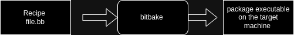
# Recipe (.bb)
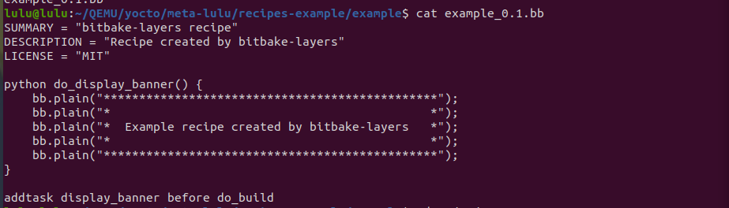
## content of this file  
- Header: 

1. Documentation & Description
```sh 
SUMMARY = "bitbake-layers recipe"
DESCRIPTION = "Recipe created by bitbake-layers"
```
2. License(must) 
```sh
LICENSE = "MIT"
# if you don't need license
LICENSE = "Closed"
```
you can git all licence needed to write recipe 
```sh 
cd /poky/meta/files/common-licenses
```
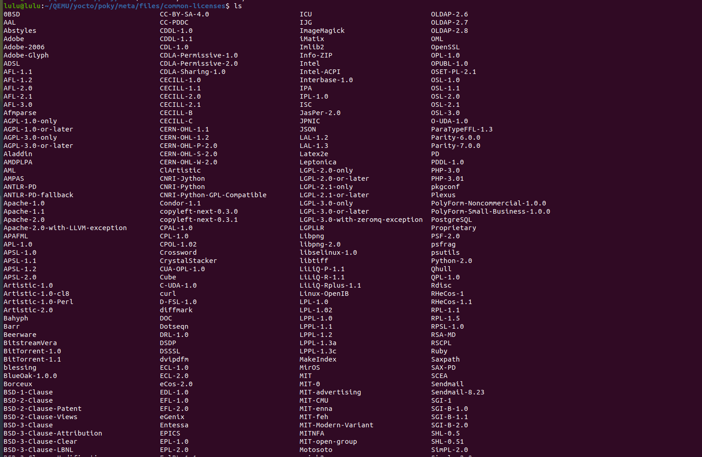
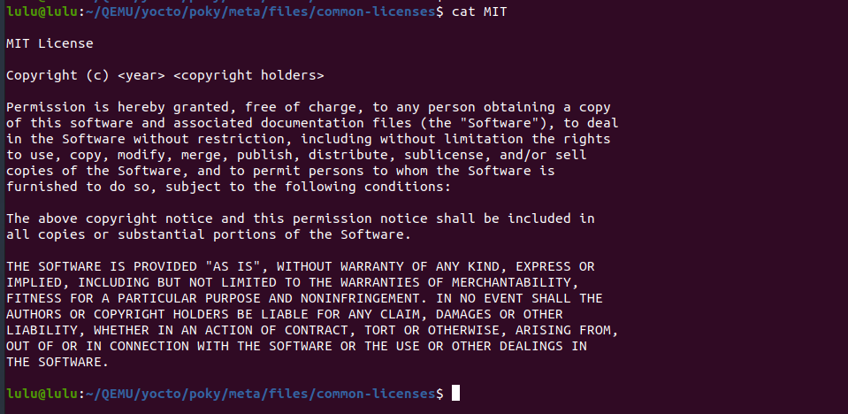

3. license check sum file
if you set LICENSE  you must set this variable So, how we can calculate Check sum
```sh
md5sum <file>
```
```sh 
md5sum MIT 
```
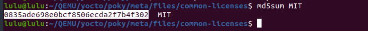
 
```sh 
# in file .bb
#LIC_FILES_CHKSUM="<schema>://<Location path>;md5=<HASH>"
LIC_FILES_CHKSUM="file://COPYRIGHT;md5=0835ade698e0bcf8506ecda2f7b4f302"
#LIC_FILES_CHKSUM="file://${COREBASE}/meta/files/common-license/;md5=0835ade698e0bcf8506ecda2f7b4f302"
```

#### Schema (where the license)
- Local file: "file://"
- Git-Hub (clone through SSH or HTTP): ""
- HTTP server (normal download like wget): ""

 
4. SRC_URL 
responsible for clone file (in bitbake: fetch in DL) 
- To clone from repo 
```sh 
SRC_URL="git://<repo link>,protocol=<protocol>,branch=<branch>"
SRC_URL="git://git...com,protocol=https,branch=main"
```
- locally 
```sh
# file should be located in spacial place
# Spacial place:  
SRC_URL="file://<filename>"
```
#### only used with git schema

5. source revision
```sh 
#check specific hash commit
SRC_REV="commit hash"
```

## There is another local variables hidden in each recipe 
#### How to name a recipe 
PV_PV-PR.bb
- PV: Package Version 
- PR: Package Release 
- PN: package Name

- S: source directory for recipe (un pack gz & zip)
- D: destination directory used by package feeder 
- B: build directory  (compile)
- WORKDIR: top directory include S, D and B directories 

## How to know the value for a local variable  
```sh
# -e: expend  
bitbake -e <recipe name> | grep variable name 
```


- Look at the difference between `bitbake <recipe>` and `bitbake <recipe> -e`
```sh
bitbake example
```
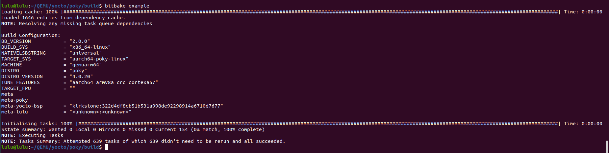

```sh
bitbake example -e > ~/pythonScript
vim ~/pythonScript  
```
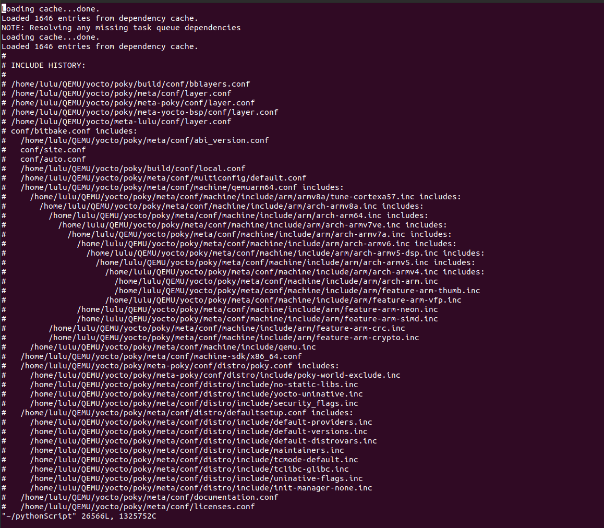
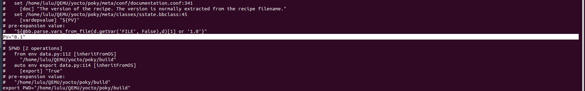


# write our recipe 
1. Create recipe 
```sh 
# in my layer 
mkdir recipes-<recipename>
mkdir recipes-<recipename>/<recipename>
touch recipes-<recipename>/<recipename>/<recipename>_PV.bb
```
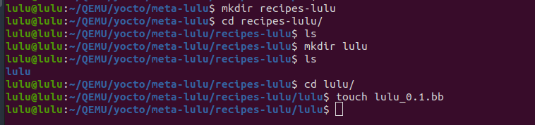


```sh 
# to see compile and build functions and hidden variables 
bitbake -e lulu > expandScript
```
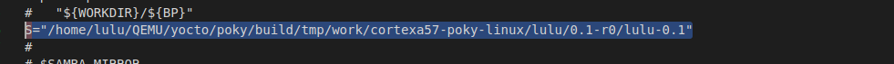
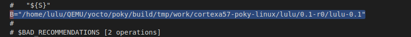
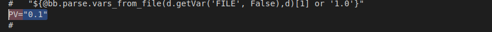
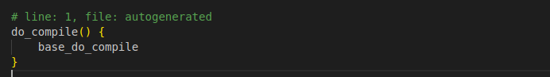
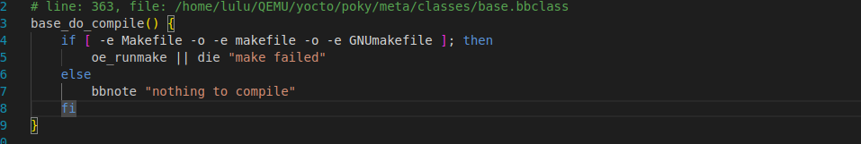


2. write recipe 

```sh 
# HEADER SECTION
SUMMARY = "hello from lulu layer"
DESCRIPTION = "Recipe created by lulu-layer"
LICENSE = "MIT"
LIC_FILES_CHKSUM = "file://${COREBASE}/meta/files/common-licenses/MIT;md5=0835ade698e0bcf8506ecda2f7b4f302"

# add path of the app
# THISDIR="/home/lulu/QEMU/yocto/meta-lulu/recipes-example/lulu_recipe"
FILESPATH:append = " :${THISDIR}/app:"
# our app
SRC_URI = "file://main.c"

# we can see CC and CFLAGS in expandScript
# overwrite on generated function in expandScript
do_compile() {
    ${CC} ${CFLAGS} -static ${WORKDIR}/main.c -o ${B}/myapp
    }

```
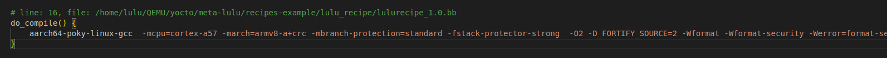

```sh 
bitbake <recipename>
```

```sh
WORKDIR="/home/lulu/QEMU/yocto/poky/build/tmp/work/cortexa57-poky-linux/lulurecipe/1.0-r0"
```
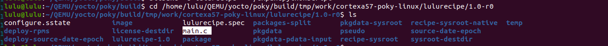

```sh
B="/home/lulu/QEMU/yocto/poky/build/tmp/work/cortexa57-poky-linux/lulurecipe/1.0-r0/lulurecipe-1.0"
```
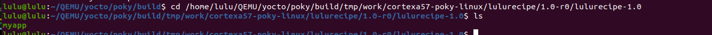

```sh
#run application
./myapp
```
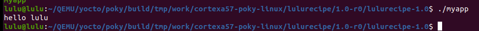


- add Where will the app be located in image
```sh 
# edit in recipe 
do_install(){
    #D="/home/lulu/QEMU/yocto/poky/build/tmp/work/cortexa57-poky-linux/lulurecipe/1.0-r0/image"
    #export bindir="/usr/bin"
    mkdir -p ${D}/usr/bin
    cp ${B}/myapp ${D}/usr/bin
    # or 
    #mkdir -p ${D}${bindir}
    # cp ${B}/myapp ${D}${bindir}
}
```
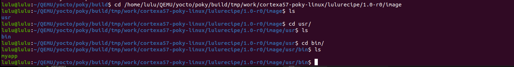


# To know all tasks and variables of bitbake 
```sh
cd /poky/meta/conf/documentation.conf
```
# to know target file system paths
```sh
cd /poky/meta/conf/bitbake.conf
```


