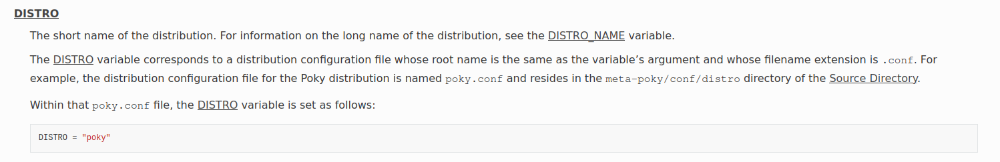
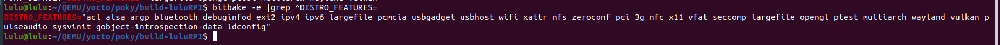
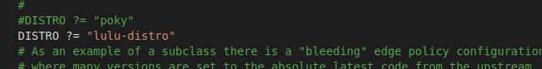
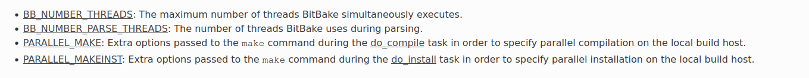

# Creating Your Own Distribution
## Steps 
1. Create a layer for your new distro
- i use my layer 
2. Create the distribution configuration file:
```sh
mkdir meta-lulu/conf/distro
touch meta-lulu/conf/distro/lulu-distro.conf
```
Note: The DISTRO variable in your local.conf file determines the name of your distribution.


3. set the following required variables:

- DISTRO_NAME: The long name of the distribution. For information on the short name of the distribution

- DISTRO_VERSION: The version of the distribution.

### These following variables are optional and you typically set them from the distribution configuration file:

- DISTRO_FEATURES: The software support you want in your distribution for various features. You define your distribution features in the distribution configuration file.

In most cases, the presence or absence of a feature in DISTRO_FEATURES is translated to the appropriate option supplied to the configure script during the do_configure task for recipes that optionally support the feature.

- DISTRO_EXTRA_RDEPENDS: Specifies a list of distro-specific packages to add to all images. This variable takes effect through packagegroup-base so the variable only really applies to the more full-featured images that include packagegroup-base. You can use this variable to keep distro policy out of generic images. As with all other distro variables, you set this variable in the distro .conf file.
- DISTRO_EXTRA_RRECOMMENDS: Specifies a list of distro-specific packages to add to all images if the packages exist. The packages might not exist or be empty (e.g. kernel modules). The list of packages are automatically installed but you can remove them.
- TCLIBC: Specifies the GNU standard C library (libc) variant to use during the build process.

    You can select “glibc”, “musl”, “newlib”, or “baremetal”.

```sh
DISTRO_NAME = "lulu"
DISTRO_VERSION = "1.0"
```
4. include the poky.conf from meta-poky/conf/distro/poky.conf
```sh
# require make error if distro does not exist
# in meta-poky
require conf/distro/poky.conf
```
5. remove all not important features 
```sh
DISTRO_FEATURES:remove = " pcmcia pci nfc ptest 3g"
```

5. Point to Your distribution configuration file
```sh
#In your local.conf file in the Build Directory, set your DISTRO variable to point to your distribution’s configuration file.

DISTRO = "lulu-distro"
```


6. add System d
```sh 
INIT_MANAGER = "systemd"
```

7. Speeding Up a Build
```sh
# BE CAREFULL maximum number is 20 
BB_NUMBER_THREADS ?= "6" 
PARALLEL_MAKE ?= "-j 6" 
```


Inheriting the rm_work class: Inheriting this class has shown to speed up builds due to significantly lower amounts of data stored in the data cache as well as on disk. Inheriting this class also makes cleanup of TMPDIR faster, at the expense of being easily able to dive into the source code. File system maintainers have recommended that the fastest way to clean up large numbers of files is to reformat partitions rather than delete files due to the linear nature of partitions. This, of course, assumes you structure the disk partitions and file systems in a way that this is practical.

```sh 
INHERIT += "rm_work"
```
