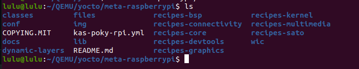
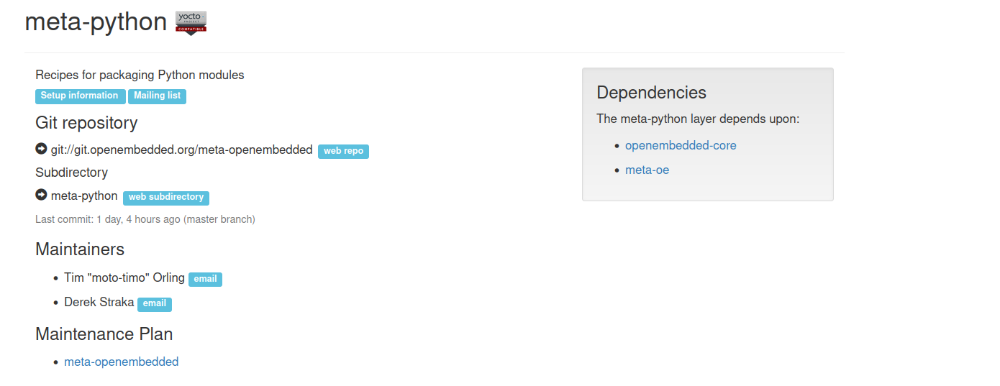
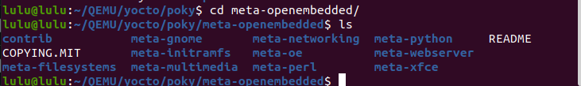
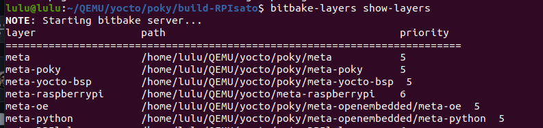
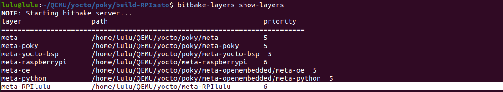
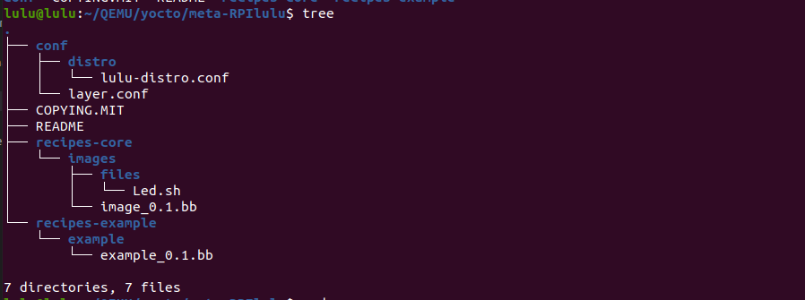
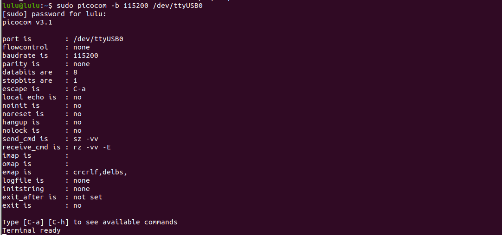
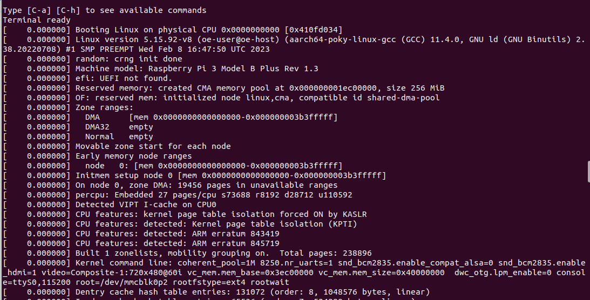
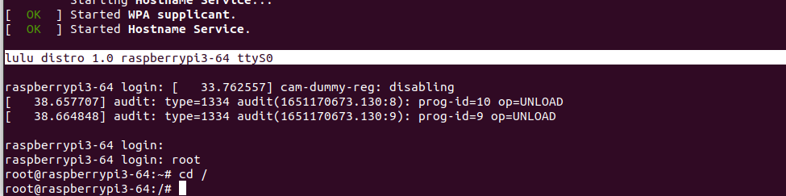
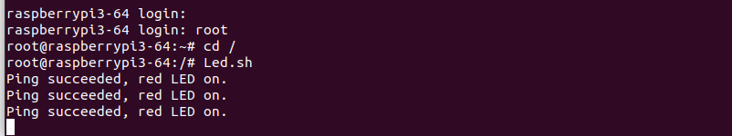

# yocto RPI image 
## Steps 
1. get the meta-raspberrypi (BSP)
```sh
git clone -b kirkstone https://github.com/agherzan/meta-raspberrypi.git
```


2. get meta-python (if you use python scripts)
```sh

```


- so we need meta-oe (Dependencies)
- clone all meta-openembedded
```sh
git clone -b kirkstone https://github.com/openembedded/meta-openembedded.git
```


- add needed layers
```sh
cd <your-build-dir>
bitbake-layers add-layer <add layer>
```
i add meta-python, meta-oe and meta-raspberrypi

```sh
bitbake-layers show-layers
```


3. Build sato image


```sh
bitbake core-image-sato
# you can run this to do all fetches in beginning 
#bitbake --runall=fetch core-image-sato
#bitbake core-image-sato -k
```
4. create our layer 
```sh
bitbake-layers create-layer <path to your layer>
bitbake-layers add-layer <add layer>
```


5. adjust layer
- add distro 
```sh
MAINTAINER = "lulu <marinamosaad31@gmail.com>"
require conf/distro/poky.conf
DISTRO = "lulu-distro"
DISTRO_NAME = "lulu distro"
DISTRO_VERSION = "1.0"
DISTRO_CODENAME = "kirkstone"
DISTRO_FEATURES:remove = " pcmcia pci nfc ptest 3g ext2"
INIT_MANAGER = "systemd"
ENABLE_UART = "1"
```
- add recipe (image.bb)

```sh
# HEADER SECTION
SUMMARY = "RPI image"
DESCRIPTION = "Recipe created by lulu, image for RPI"
LICENSE = "MIT"
LIC_FILES_CHKSUM = "file://${COREBASE}/meta/files/common-licenses/MIT;md5=0835ade698e0bcf8506ecda2f7b4f302"

# Add bash as a runtime dependency
RDEPENDS:${PN} += "bash"

SRC_URI = "file://Led.sh"

do_install() {
    install -d ${D}${bindir}
    install -m 0755 ${WORKDIR}/Led.sh ${D}${bindir}/Led.sh
}
```
- add the script 

###### if ping host successfully turn on red led else turn on green led (you can wite it in python)
```sh
#!/bin/bash

# Define the GPIO pins for the LEDs
RED_LED_PIN=23   # Red LED
GREEN_LED_PIN=24 # Green LED

# Replace with the host you want to ping
HOST="<host ip>"

# Initialize GPIO pins
setup_gpio() {
    echo "$RED_LED_PIN" > /sys/class/gpio/export
    echo "$GREEN_LED_PIN" > /sys/class/gpio/export
    echo "out" > /sys/class/gpio/gpio$RED_LED_PIN/direction
    echo "out" > /sys/class/gpio/gpio$GREEN_LED_PIN/direction
}

# Cleanup GPIO pins
cleanup_gpio() {
    echo "$RED_LED_PIN" > /sys/class/gpio/unexport
    echo "$GREEN_LED_PIN" > /sys/class/gpio/unexport
}

# Turn on the LED
turn_on_led() {
    local pin=$1
    echo "1" > /sys/class/gpio/gpio$pin/value
}

# Turn off the LED
turn_off_led() {
    local pin=$1
    echo "0" > /sys/class/gpio/gpio$pin/value
}

# Ping the host
ping_host() {
    ping -c 1 -w 5 "$HOST" > /dev/null 2>&1
    return $?
}

# Main loop
main_loop() {
    while true; do
        if ping_host; then
            # Ping succeeded
            turn_on_led $RED_LED_PIN
            turn_off_led $GREEN_LED_PIN
            echo "Ping succeeded, red LED on."
            sleep 40
            turn_off_led $RED_LED_PIN
        else
            # Ping failed
            turn_on_led $GREEN_LED_PIN
            turn_off_led $RED_LED_PIN
            echo "Ping failed, green LED on."
            sleep 10
        fi
    done
}

# Setup GPIO, run the main loop, and ensure cleanup on exit
trap cleanup_gpio EXIT
setup_gpio
main_loop
```



6. adjust local.cong file 
```sh
# edit machine
MACHINE ??= "raspberrypi3-64"
# edit distro 
DISTRO ?= "lulu-distro"

# add this part 
BB_NUMBER_THREADS ?= "6" 
PARALLEL_MAKE ?= "-j 6" 


IMAGE_INSTALL += " strace "
IMAGE_FSTYPES = "tar.bz2 ext4 rpi-sdimg wic"
IMAGE_INSTALL:append = " python3 apt bash git python3-pip"
IMAGE_INSTALL:append = " packagegroup-core-boot"
# my recipe
IMAGE_INSTALL:append = " image" 
``` 

7. rebuild sato image 
```sh
bitbake core-image-sato
```
8. Flash the image
```sh
# image path <build>/tmp/deploy/images/<target>/start with your recipe name
sudo dd if=/home/lulu/QEMU/yocto/poky/build-RPIsato/tmp/deploy/images/raspberrypi3-64/core-image-sato-raspberrypi3-64-20240821233712.rootfs.rpi-sdimg of=/dev/mmcblk0 bs=1M

```
8. Test
```sh
sudo picocom -b 115200 /dev/ttyUSB0
```


- power it 



- run the script 
```sh
root 
cd /
Led.sh
```

