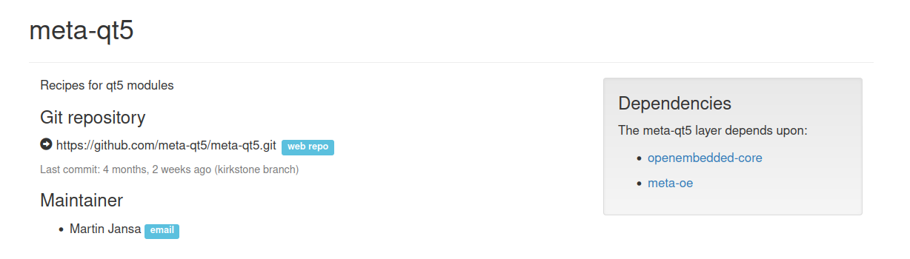
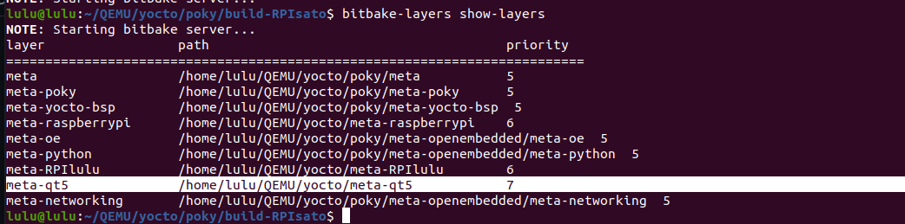
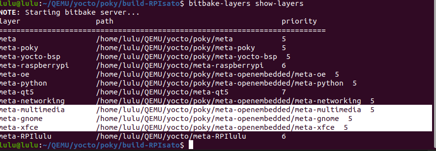
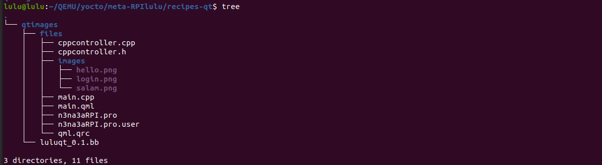

# Adding Qt to image for RPI
## Steps 
1. Clone meta-Qt
```sh 
# clone layer 
git clone -b kirkstone https://github.com/meta-qt5/meta-qt5.git
```


make sure you have all Dependencies.

2. Add meta-Qt

```sh
# add layer 
bitbake-layers add-layer <pathh of layer> 
```


3. add nedded layers 
```sh 
bitbake-layers add-layer /meta-openembedded meta-multimedia 
bitbake-layers add-layer /meta-openembedded/meta-multimedia
bitbake-layers add-layer /meta-openembedded/meta-gnome 
```



3. update our distro

```sh 
# add 
DISTRO_FEATURES:append = "  ptest qt5 opengl"
```

4. make recipe for Qt 
```sh 
# luluqt.bb
SUMMARY = "QML application for Raspberry Pi"
DESCRIPTION = "A simple QML-based application for Raspberry Pi to demonstrate a login page and LED control"
LICENSE = "MIT"
LIC_FILES_CHKSUM = "file://${COREBASE}/meta/files/common-licenses/MIT;md5=0835ade698e0bcf8506ecda2f7b4f302"

SRC_URI = "file://cppcontroller.cpp \
           file://cppcontroller.h \
           file://main.cpp \
           file://main.qml \
           file://n3na3aRPI.pro \
           file://qml.qrc \
           file://images/hello.png \
           file://images/salam.png \
           file://images/login.png "

S = "${WORKDIR}"

DEPENDS = "qtbase qtdeclarative qtquickcontrols2 qttools"

inherit qmake5
inherit qmake5_base


do_compile() {
    # the OE_QMAKE_COMPILER environment variable to the value of the CXX environment variable, which represents the C++ compiler being used in the Yocto build environment
    oe_runmake -C ${B}
}
do_install() {
    install -d ${D}${bindir}
    install -m 0755 ${B}/n3na3aRPI ${D}${bindir}/n3na3aRPI
}


```
- add source files for your Qt app in files directory 


5. Update local.conf 

```sh
# Include Qt Libraries
IMAGE_INSTALL:append = " qtimageformats qtmultimedia cinematicexperience liberation-fonts qtbase-dev curl wget userland gstreamer1.0-plugins-bad qtsvg"
IMAGE_INSTALL:append = " qtbase qtbase-tools qtbase-plugins qtdeclarative qttools"
IMAGE_INSTALL:append = " qtquickcontrols qtquickcontrols2 "

# Include Qt recipe 
IMAGE_INSTALL:append = " luluqt"
```

6. Build image 
```sh 
bitbake core-image-sato
```
7. Flash the image 
```sh
# image path <build>/tmp/deploy/images/<target>/start with your recipe name
sudo dd if=/home/lulu/QEMU/yocto/poky/build-RPIsato/tmp/deploy/images/raspberrypi3-64/core-image-sato-raspberrypi3-64-20240821233712.rootfs.rpi-sdimg of=/dev/mmcblk0 bs=1M

```
8. Test 
```sh
sudo picocom -b 115200 /dev/ttyUSB0
```
- run the app
```sh
root
cd /
n3na3aRPI -platform offscreen
```