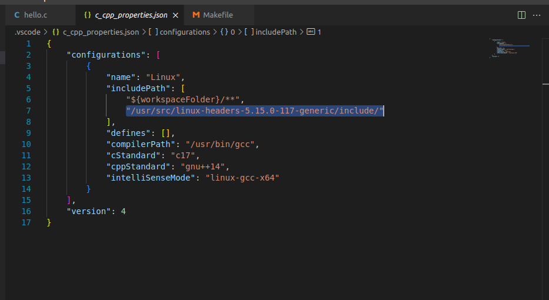
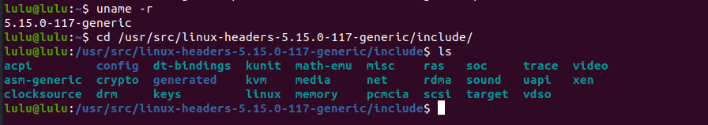

# LKM linux kernel module 
- Kernel: handle tasks and interface during run time 
- Module: like driver but not driver(module more generic ) 
    - Static(.o): during linux compilation (in booting time)   
        - within linux Image
        - increase the size of image so increase kernel startup time 
    - Dynamic(.ko): during runtime (user space)(in /dev rootfs)
        - less kernel startup time
        - consume RAM the (.ko) size larger than (.o)
        - high module startup time 

### why LKM ?!
to extend linux functionality 
- security 
- file system 
- device driver 

### why (.ko) larger than (.o)
in static i can't unload module so i don't need to exit section 
- Static have init section & code section 
- Dynamic have nit section & code section & exit section, so (.ko) is larger 

### LKM syntax 
1. Header section 
#include (kernel header)
```sh
# Before building anything, it is necessary to install the header files for the kernel.
sudo apt-get update 
# uname -r show my kernel version 
sudo apt install linux-headers-$(uname -r)
```
- in VS code 
    - Quick fix the header 
    - add your path to header into includePath in .json file
```sh 
/usr/src/linux-header<your linux version>/include
```


- linux header must be compatible with linux source code(.c)
- headers in /usr/src/linux-header<your linux version>/include


##### NO USER SPACE LIBRARY IS LINKED WITH KERNEL MODULE 

2. Code section (c code)
- linux gives you all what you need (template)
- here i don't have main function cause the kernel has the main function 
- module has two function 
    - module initialization: init function 
        - int func_name(void)
    - module deinitialization: exit function 
        - void func_name(void)
- add the two function to macro like function(pointer to function)
    - module_init(func_name)
    - module_exit(funcname)


#### linux command to inject module 
1. insmod: insert module by root (or sudo)
2. rmmod: remove module by root (or sudo)
3. modprobe: insert and remove based on flag (-r to remove) by root (or sudo) 
4. lsmod: show static and dynamic modules loaded in kernel 

#### Device driver Categories 
1. Character device 
2. block device (storage)
3. network device 


###### Delete files to save your size 
- /var/log/syslog
- /var/log/kern.log


##### [reference](https://sysprog21.github.io/lkmpg/#before-we-begin)