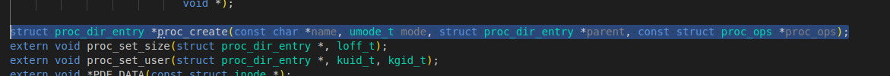
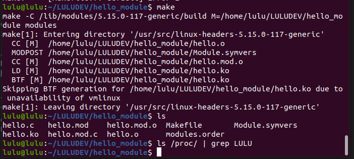
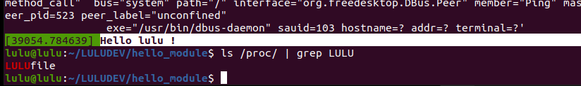
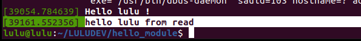
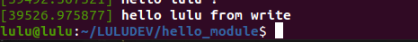

# proc file system 
all files create under proc /proc/* made by kernel 
- proc: is a data structure in RAM(kernel space)
- i need to append file into proc data structure to appear in user space (so i need kernel module)
- we can see this structure in header file 
```c
#include <linux/proc-fs.h>
```
- to create file under proc use function proc_create 
```c
struct proc_dir_entry *proc_create(const char *name, umode_t mode, struct proc_dir_entry *parent, const struct proc_ops *proc_ops);

//const char *name: name of file 
//umode_t mode: rwx  
// struct proc_dir_entry *parent: if i need to create directory parent of my file
// const struct proc_ops *proc_ops: operation
```


- struct proc_ops 

```c
struct proc_ops {
	unsigned int proc_flags;
    //system calls
	int	(*proc_open)(struct inode *, struct file *);
    // pointer to function
	ssize_t	(*proc_read)(struct file *, char __user *, size_t, loff_t *);
	ssize_t (*proc_read_iter)(struct kiocb *, struct iov_iter *);
	ssize_t	(*proc_write)(struct file *, const char __user *, size_t, loff_t *);
	/* mandatory unless nonseekable_open() or equivalent is used */
	loff_t	(*proc_lseek)(struct file *, loff_t, int);
	int	(*proc_release)(struct inode *, struct file *);
	__poll_t (*proc_poll)(struct file *, struct poll_table_struct *);
	long	(*proc_ioctl)(struct file *, unsigned int, unsigned long);
#ifdef CONFIG_COMPAT
	long	(*proc_compat_ioctl)(struct file *, unsigned int, unsigned long);
#endif
	int	(*proc_mmap)(struct file *, struct vm_area_struct *);
	unsigned long (*proc_get_unmapped_area)(struct file *, unsigned long, unsigned long, unsigned long, unsigned long);
} __randomize_layout;

```


- remove proc 
```sh 
extern void proc_remove(struct proc_dir_entry *);
```


###### Operations can run over files 
- read (system call) 
- write (system call)

###### edit in our module

```c
// prototypes
ssize_t luluread(struct file *files, char __user *buff, size_t size, loff_t *loff);
ssize_t luluwrite(struct file *files, const char __user *buff, size_t size, loff_t *loff);
// file operators struct
const struct proc_ops proc_file_operations =
{
.proc_read=luluread;
.proc_write=luluwrite;

}
// create return 
struct proc_dir_entry *proc_dir;
 
// read operator function implementations 
ssize_t luluread(struct file *files, char __user *buff, size_t size, loff_t *loff)
{
    printk("hello lulu from read\n");
    return 0;

}
// write operator function implementations
ssize_t luluwrite(struct file *files, const char __user *buff, size_t size, loff_t *loff)
{
    printk("hello lulu from write\n");
    return 3;
}

// module init function 
static int __init hello_init(void)
{   
    // create file 
    proc_dir = proc_create(LULUfile, 0666, NULL , &proc_file_operations);
	printk("Hello lulu !\n");

	return 0;
}

// module exit function
static void __exit hello_exit(void)
{
    // remove file 
    proc_remove(proc_dir);
	printk("bye bye lulu\n");
}

module_init(hello_init);
module_exit(hello_exit);
// because kernel care 
MODULE_LICENSE("GPL"); 

```

## Building 
```sh
make clean 
make 
# to know if there is any LULUfile in proc before insert our module 
ls /proc/ | grep LULUfile
```


```sh 
sudo insmod hello.ko
dmesg
ls /proc/ | grep LULUfile
```


```sh 
cat /proc/LULUfile
dmesg
```


```sh 
echo 1 > /proc/LULUfile
dmesg 
```



## To receive from user  
use write system call 
```c
ssize_t luluwrite(struct file *files, const char __user *buff, size_t size, loff_t *loff)
```
```sh 
echo 1 > /proc/LULUfile 
OR
write (fd,buff,size)
```
- when user write 1 it store in buffer 
`const char __user *buff`
- but buffer not a physical address its a page address so i cannot dereference it

- But Kernel solve it by 
```c
// macro like function
copy-from-user(destination , source , size)
```
```c
char buffer[10];
// check if the size > 10 (handle it)
(void)copy-from-user(buffer , buff , size)
```