# Virtual Device 
i work on ubuntu not RPI so i cannot connect actual device and use virtual 

- storage virtual device (character device)
simply it buffer 
```c
char buffer[size];
```

# create device in /dev 
## char device ID 
- each device in system (/dev) has an ID of 32 bits (stored in kernel data base on variable type dev_t) 
    - major number 12 bits: identifies the driver responsible for that device 
    - minor number 20 bits: identifies the number of that device 

- Allocate ID to device 
```c
int RETURN;//return status of function 
dev_t devID;
RETURN = alloc_chrdev_region(&devID,base minor number, no of devices that driver responsible for ,"driver name");
//can get major number and minor number 
int x=MAJOR(devID);
int y=MINOR(devID);
```

- Deallocate ID 

```c
unregister_chardev_region(devID,no of devices);
```

## create Class 
#### using Udev 
- udev: is a device manager (service) responsible for create any character device in /dev

- create directory(class) in /sys/class/ include all devices 
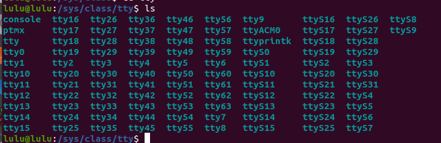
- each device has files 
 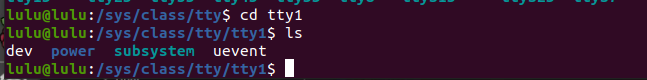
 - dev: include ID of the device 
 - uevent: when this file created udev come to this directory and create device within its ID 
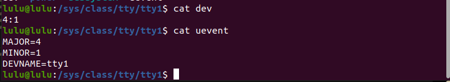


```c 
// to create like this class 
#include <linux/device.h>
struct class  *LULUCLASS;
//null if there is a directory with same name 
LULUCLASS = class_create(THIS_MODULE,"directory name");
```
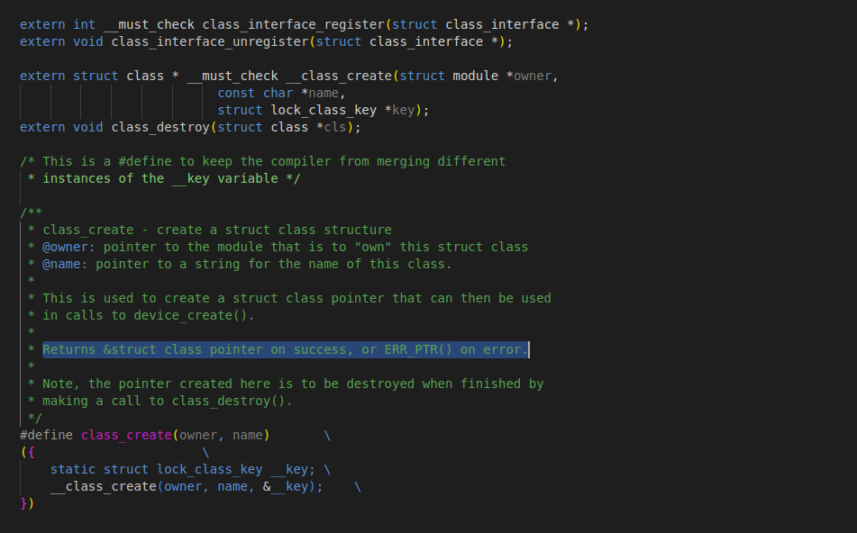

- TO delete the directory 
```c
class_destroy(LULUCLASS);
```
- insert module
```sh
make 
sudo insmod dev.ko
dmesg
```
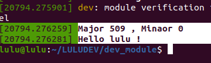
Now, the class will appear in /sys/class/<Class name>.
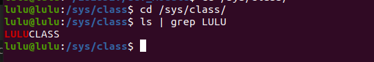

## create a device 
```c
struct device * LULUdevice ;
   //create directory mapped under /sys/devices/virtual/LULUCLASS/dev
   //create dev file include the ID  
    LULUdevice = device_create(LULUCLASS , NULL , devID ,  NULL , "dev");
```
- delete device 
```c
device_destroy(LULUclass , devID);
```
- insert module
```sh
make 
sudo insmod dev.ko
dmesg
```
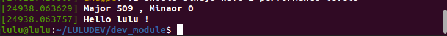
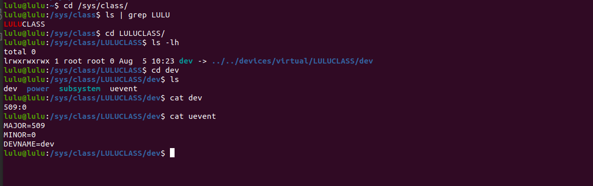


## register device with VFS
VFS: virtual file system 
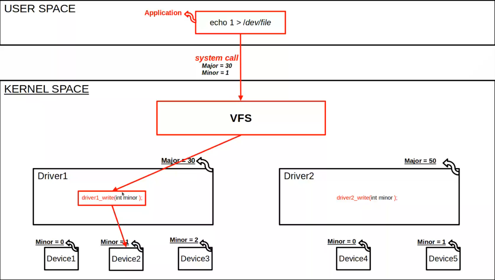
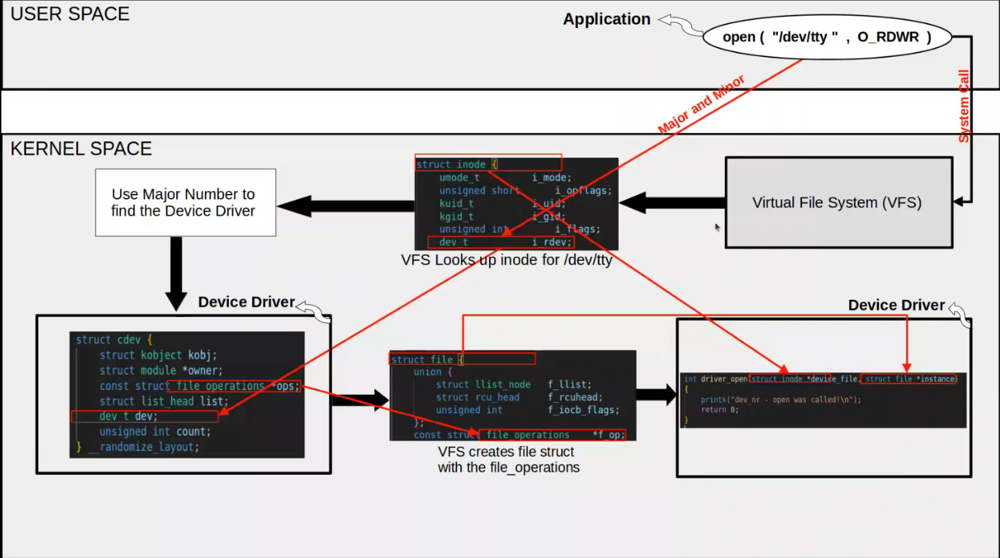
```c
struct cdev LULUcdev;
 // file operators struct
struct file_operations LULUfops = {
    .owner = THIS_MODULE ,
    .read = luluread ,
    .write = luluwrite ,
    .release = luluclose ,
    .open = luluopen ,
}; 
// read operator implementations
// write operator implementations
// open operator implementations
// close operator implementations

   //register device file in VFS 
   // initialize struct cdev
   // add file operations
      cdev_init(&LULUcdev , &LULUfops);\
    // add ID
      cdev_add(&LULUcdev , devID , 1);
```

- insert module
```sh
make 
sudo insmod dev.ko
cd /dev 
sudo chmod 777 /dev/dev
sudo dmesg -c
cat dev
sudo dmesg 
```
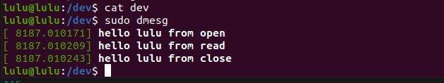
