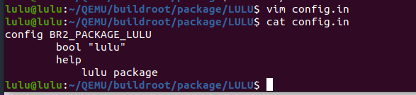
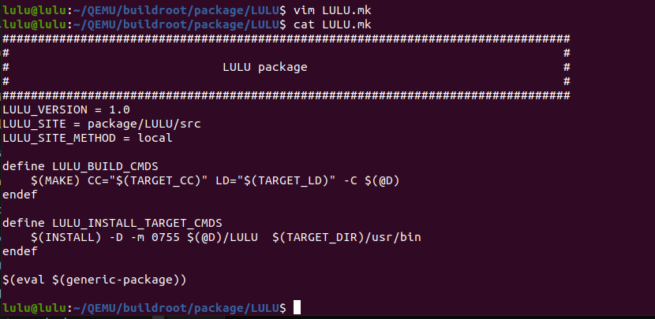
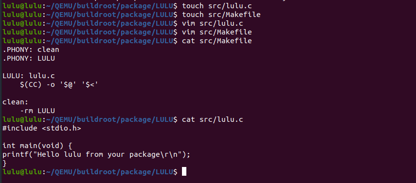
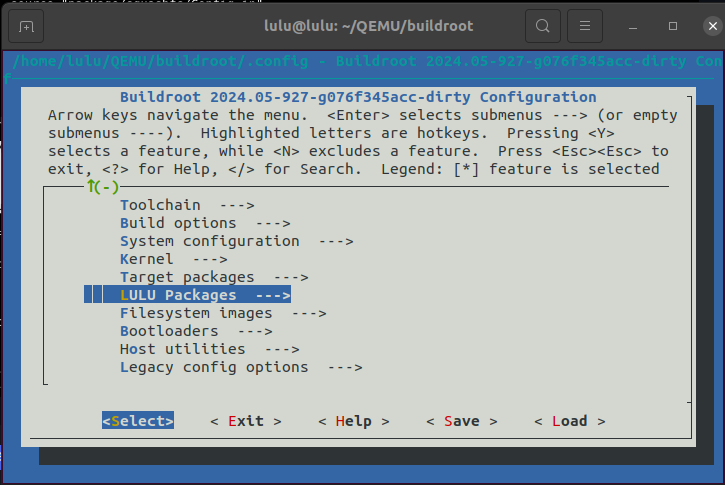
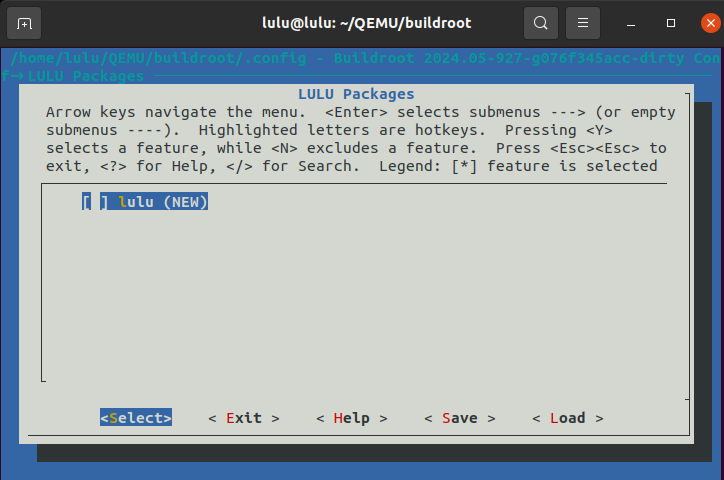
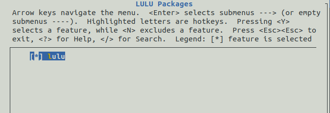
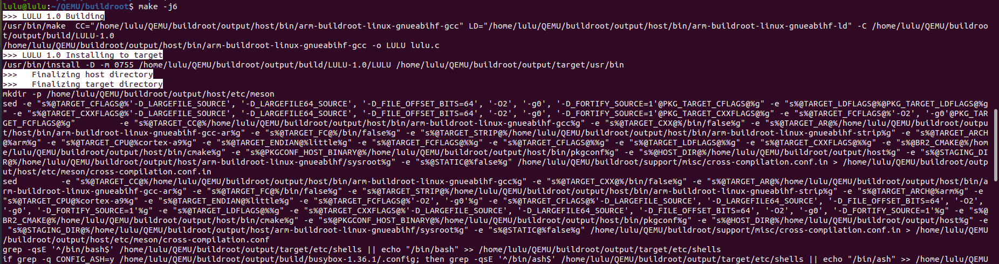
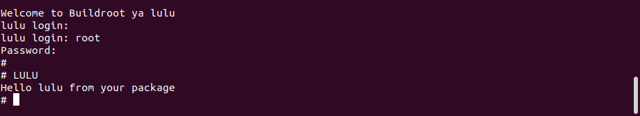

#  Adding new package to Buildroot
## Steps 

1. First of all, create a directory under the package directory for your software, for example LULU.
```sh 
cd <path>/buildroot/package
mkdir LULU
```

2. Add config file 
For the package to be displayed in the configuration tool

- Config.in file: For packages used on the target,This file will contain the option descriptions related to our <LULU> software that will be used and displayed in the configuration tool
```sh
cd LULU
vim Config.in
```
```sh
config BR2_PACKAGE_LULU
        bool "lulu"
        help
            lulu package 
```


Finally you have to add your new LULU/Config.in to package/Config.in 
```sh
menu "LULU Packages"
    source "package/LULU/Config.in"
endmenu

```

3. Add .mk file
here’s the hardest part. Create a file named LULU.mk. It provides a blueprint for how the LULU package should be handled by the build system, specifying where to find the source code, how to build it, and how to install it on the target system.

```sh 
################################################################################
#                                                                              #
#                              LULU package                                    #
#                                                                              #
################################################################################

#sets the version of the LULU package 
LULU_VERSION = 1.0

# specifies the location of the source code for the LULU package.
LULU_SITE = package/LULU/src

#  defines the method to use for obtaining the source code. Here, local indicates that the source code is available locally. Other methods like git, wget, scp, file, etc., can be used depending on the source's location and access method.
LULU_SITE_METHOD = local

# This section defines the build commands for the LULU package.
# $(MAKE) invokes the make command.
# CC="$(TARGET_CC)" specifies the C compiler to use, with $(TARGET_CC) being a variable that likely holds the cross-compiler executable.
# LD="$(TARGET_LD)" specifies the linker to use.
# -C $(@D) changes the directory to the build directory of the package
define LULU_BUILD_CMDS
    $(MAKE) CC="$(TARGET_CC)" LD="$(TARGET_LD)" -C $(@D)
endef


# This section defines the installation commands for the LULU package.
# $(INSTALL) invokes the install command.
# -D ensures that the directories are created if they do not exist.
# -m 0755 sets the permissions of the installed file to 0755 (rwxr-xr-x).
# $(@D)/embeddedinn is the source file to be installed, located in the build directory.
# $(TARGET_DIR)/usr/bin is the destination directory on the target system where the file will be installed.

define LULU_INSTALL_TARGET_CMDS
    $(INSTALL) -D -m 0755 $(@D)/LULU  $(TARGET_DIR)/usr/bin
endef

# This line tells the build system to evaluate the generic package rules for this package. generic-package is typically a macro or function defined elsewhere that includes standard rules for building and installing packages. 
$(eval $(generic-package))
```


4. Add source code for the LULU package

```sh
mkdir /LULU/src
touch /LULU/src/lulu.c
touch /LULU/src/Makefile
```
```c
// c code 
#include <stdio.h>

int main(void) {
printf("Hello lulu from your package\r\n");
}
```

- Makefile 

```sh
# Makefile
.PHONY: clean
.PHONY: LULU

LULU: lulu.c
    $(CC) -o '$@' '$<'

clean:
    -rm LULU
```


5. now you can see lulu package 

```sh
make menuconfig
```



6. enable the package and save


7. rebuild 

```sh
make -j6
```


8. open QEMU
```sh 
cd output/images
./start-qemu.sh 
```
 Now the LULU command is now available in the generated RFS.


###### [Reference](https://buildroot.org/downloads/manual/manual.html#adding-packages)
