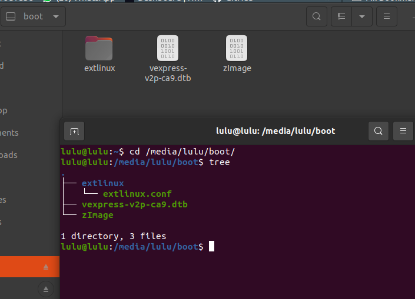
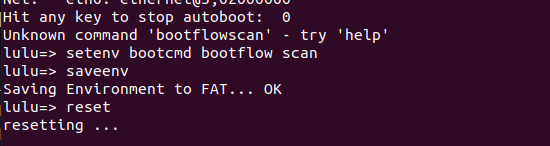
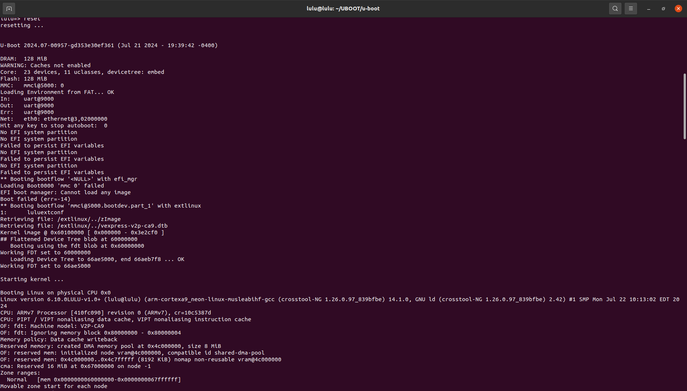
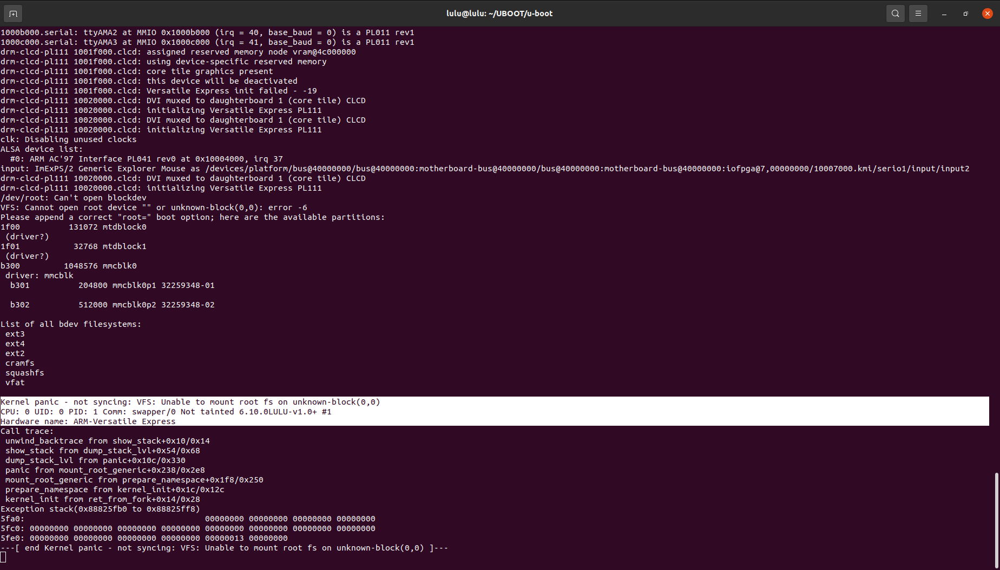

# bootflow command
The bootflow command is used to manage bootflows. It can scan bootdevs to locate bootflows, list them and boot them.

## bootflow scan 
- Scans for available bootflows, optionally booting the first valid one it finds. This operates in two modes:

    - If no bootdev is selected (see bootdev select) it scans bootflows one by one, extracting all the bootdevs from each

    - If a bootdev is selected, it just scans that one bootflow

- it search under EFI partition (partition sould be bootable and primary) 

```sh 
bootflow scan 
```
it search for extlinux.conf in extlinux directory (that replace bootcmd) in EFI.

# Steps 
1. [creat virtual SD card](https://github.com/luluehab/Embedded-Linux-New/tree/main/Embedded%20Linux/Virtual%20SD%20Card) make sure you have one bootable and primary partition partition called boot.
2. copy the files to boot
    1. zImage
    2. vexpress-v2p-ca9.dtb
3. creat extlinux directory have extlinux.conf file in boot
```sh 
mkdir extlinux 
touch extlinux/extlinux.conf
```
4. extlinux.conf
```sh 
LABEL luluextconf
    KERNEL ../zImage
    FDT ../vexpress-v2p-ca9.dtb
```


5. run Qemu with the virtual SD card
```sh
sudo qemu-system-arm -M vexpress-a9 -m 128M -nographic -kernel u-boot -sd ~/Desktop/SD_CARD/lulu.img
```

6. edit bootcmd

```sh
setenv bootcmd bootflow scan
saveenv
reset
```





- Kernel panic

## Please hang tight! We'll be back shortly to explain everything.
