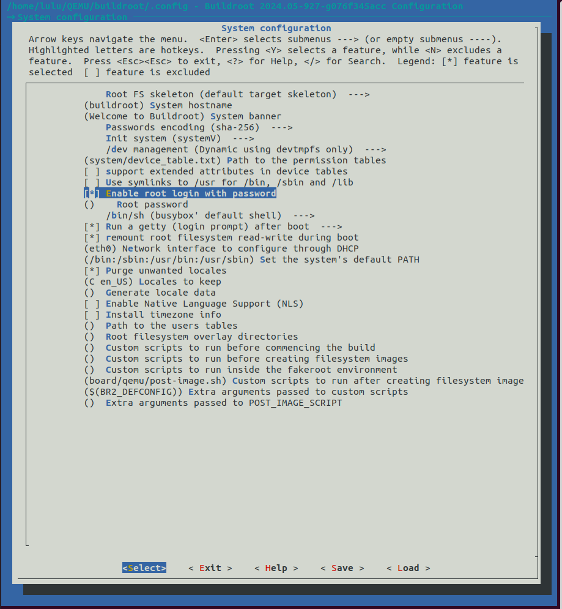
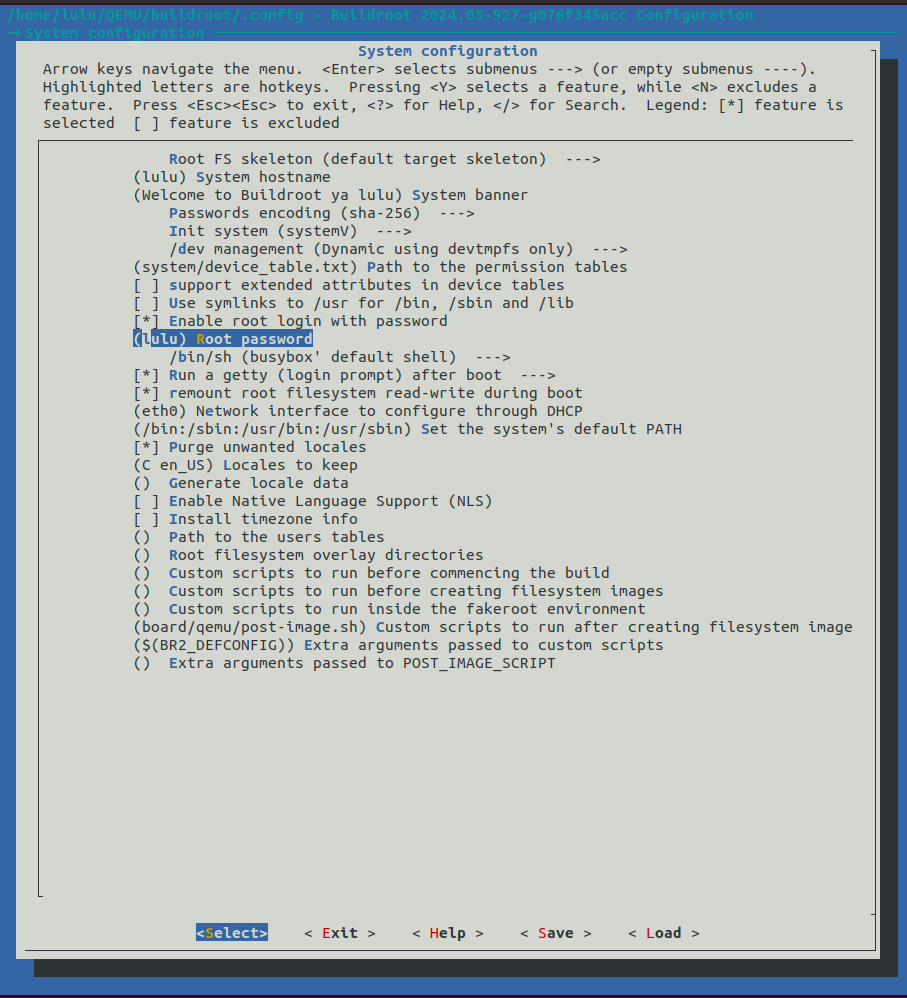
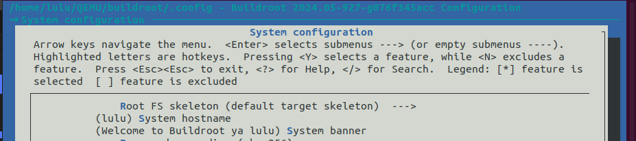
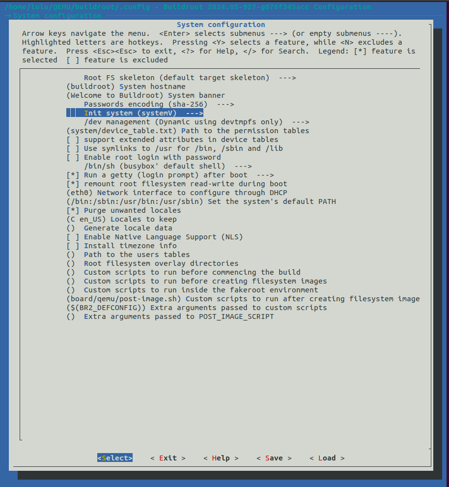
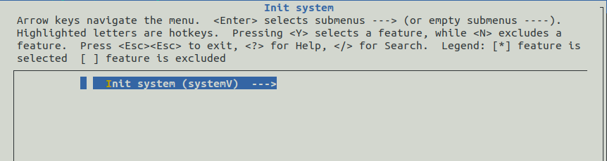
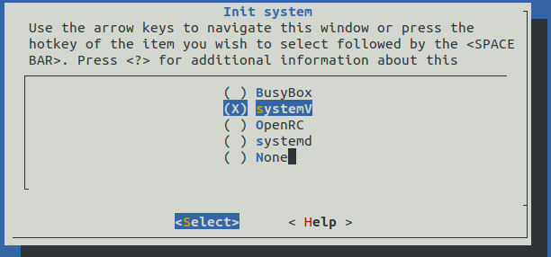
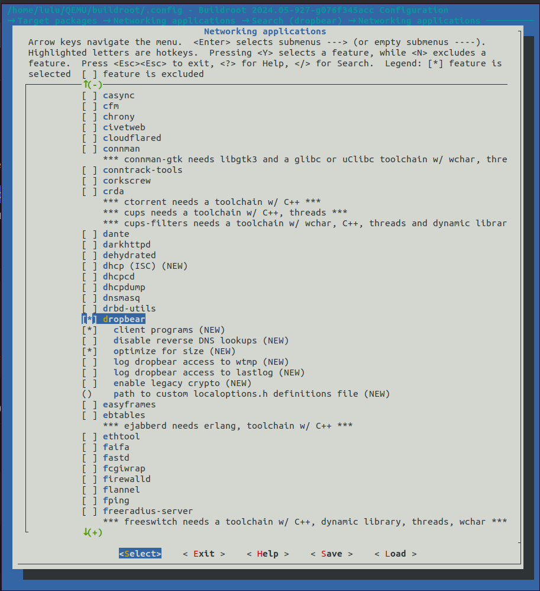
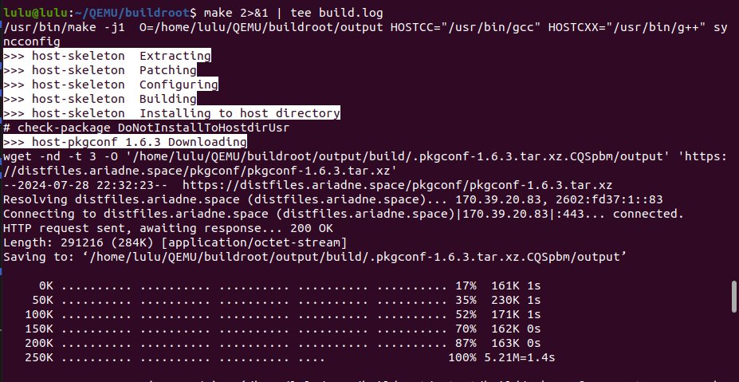

# install BuildRoot

1. prerequire Libraries
```sh 
sudo apt install sed make binutils gcc g++ bash patch gzip bzip2 perl tar cpio python unzip rsync wget libncurses-dev
```

2. clone BuildRoot

```sh
git clone https://github.com/buildroot/buildroot.git
cd buildroot
```

3. configure our target

```sh 
make list-defconfigs | grep <Target>
```
###### raspberry pi 3 
```sh
make raspberrypi3_defconfig
```
##### QEMU
```sh
make qemu_arm_vexpress_defconfig
```


4. configure BuildRoot
```sh 
make menuconfig
```
- system configration 
    - enable root login with password 
    - set password 
    
    
    - change your hostname and system banner
    
    - Init system
    
    
    

- Target package 
    - Networking applications
        - enable dropbear 
        
    
- save and exit 

5. build 
```sh 
make 2>&1 | tee build.log
```


#### "Don't just sit there, have a blast and don't wait for the build" 
