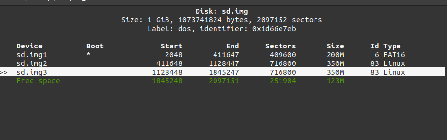
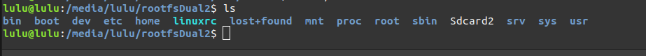
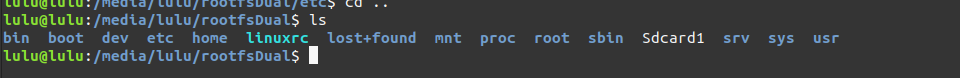
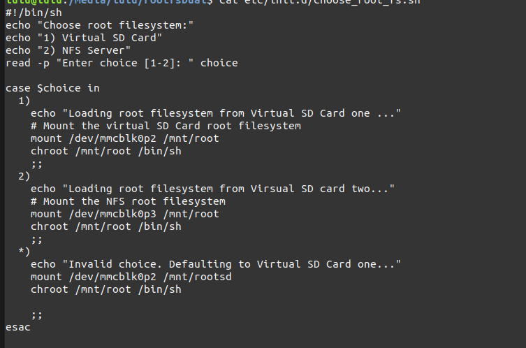
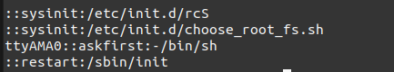
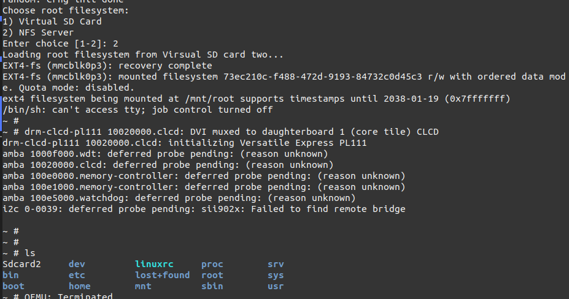
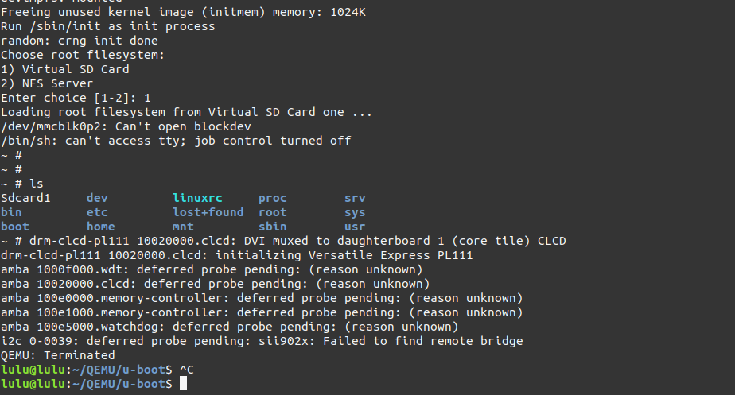

# Initramfs task
- We have initramfs image running above 2 rootfs and the kernel will firstly load the initramfs, Which has a script doing a boot manager job. The script is gonna ask the user which rootfs to be loaded
1 or 2
- If the user choise 1 then root file system from virtual sd card  will be loadded
- If the user choose 2 then root file system from nfs server 


## Steps

1. create [virtual sd card](https://github.com/luluehab/Embedded-Linux-New/tree/main/Embedded%20Linux/Virtual%20SD%20Card) with three partitions



2. copy [root file system](https://github.com/luluehab/Embedded-Linux-New/tree/main/Embedded%20Linux/BUSY%20Box) in two root partitions



3. make script in `/etc/init.d` of default root file system 

```sh 
touch choose_root_fs.sh 
```


4. edit inittab file 



5. open QEMU with our sd card 

```sh
 sudo qemu-system-arm -M vexpress-a9 -m 128M -nographic -kernel u-boot -sd ../SD_CARD/dual.img
```

6. set environment 

```sh 
setenv bootargs 'console=ttyAMA0,115200 root=/dev/mmcblk0p2 rootfstype=ext4 rw rootwait'
fatload mmc 0:1 ${kernel_addr_r} zImage
fatload mmc 0:1 ${fdt_addr_r} vexpress-v2p-ca9.dtb
saveenv
```

