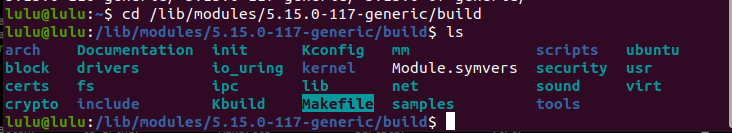
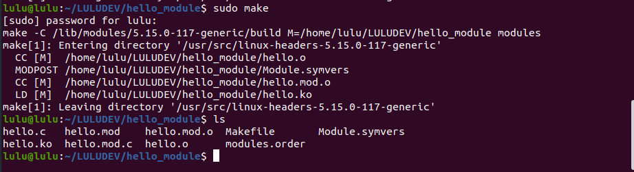
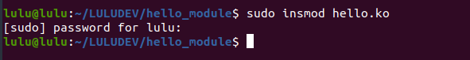
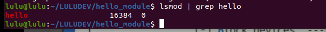
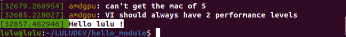
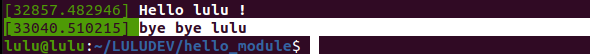

# Hello module 
## Steps 
```c
mkdir MY_devices //to include all modules 
mkdir MY_devices/hello_module
touch MY_devices/hello_module/hello.c
```
### header section 

```c
#include <linux/module.h>
#include <linux/init.h>
#include <linux/cdev.h>
#include <linux/fs.h>
```
### code section
#### init function

```c
// static: module initialize himself (no one can call it )
// __init: to delete section after initialization (save RAM) 
static int __init hello_init(void)
{
    // to indicate where am i
    // it necessary to use \n
	printk("Hello lulu !\n");

   //init function successes
	return 0;
}

```

#### exit function 

```c
// static: module initialize himself (no one can call it )
// __exit: will be need once i call rmmod
static void __exit hello_exit(void)
{
    // to indicate where am i
    // it necessary to use \n
	printk("bye bye lulu\n");
}

```

#### macro like function 

```c
// driver initialization entry point 
/* will either be called during do_initcalls() (if
builtin) or at module insertion time (if a module). There can only
be one per module.*/
module_init(hello_init);
// driver exit entry point
/* will wrap the driver clean-up code
with cleanup_module() when used with rmmod when
the driver is a module. If the driver is statically
compiled into the kernel, module_exit() has no effect.
There can only be one per module.*/
module_exit(hello_exit);
```


#### license

```c
// because kernel care 
//since you will use linux source code (GPL)
MODULE_LICENSE("GPL");
```

## Building 
- need to call Makefile in the kernel source code 
```sh
cd /lib/modules/<linux version>/build/
```


- To call this Makefile 

```sh
make -C /lib/modules/<linux version>/build/ M=<modulepath> modules
```

### create our Makefile 
- call Kernel Makefile 
- pass value obg -m (to build dynamically)

```sh
# must be the same name of file.c 
# -m: dynamic 
# -y: static
obj-m := hello.o 
# Kirnel makefile
KERNELDIR ?= /lib/modules/$(shell uname -r)/build
# module path
PWD := $(shell pwd)

default:
	$(MAKE) -C $(KERNELDIR) M=$(PWD) modules

clean:
	$(MAKE) -C $(KERNELDIR) M=$(PWD) clean

```

```sh 
sudo make
```



#### inject module 
```sh 
sudo insmod hello.ko
```





#### remove module 
```sh 
sudo rmmod hello
dmesg
```
