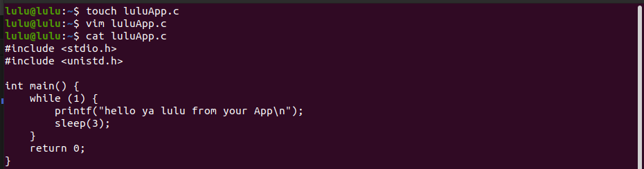
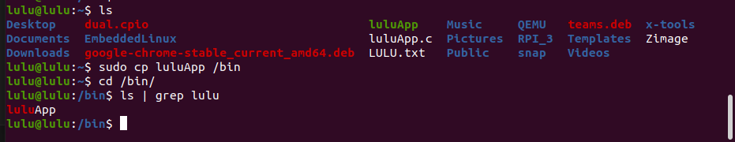
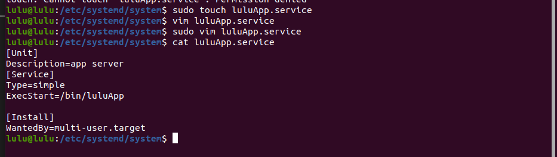
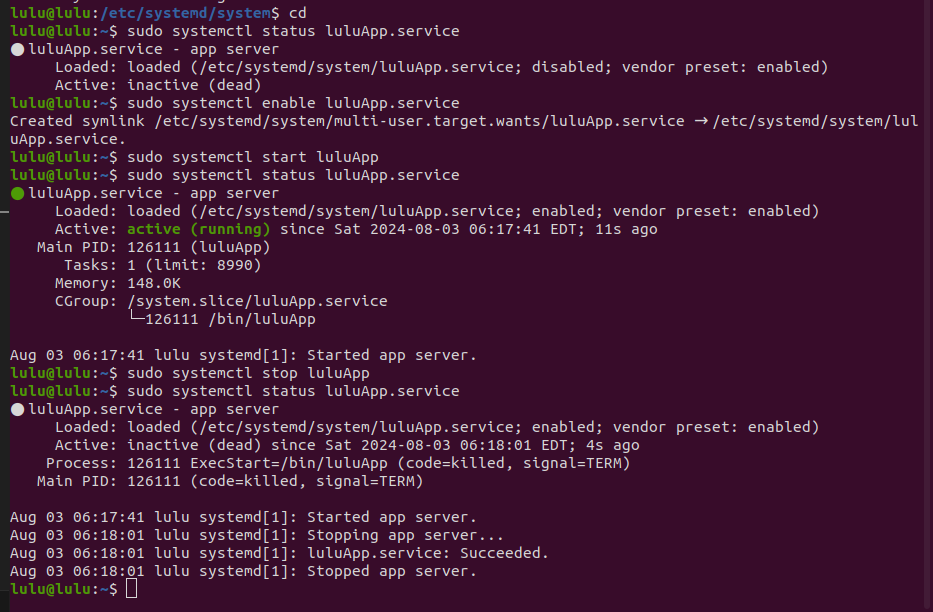

# System D Init 
## Task 2
- configure build root to run system d 
- ⁠add a service to print your name every 3 seconds


# Steps 

1. create App 
```sh
cd 
touch luluApp.c
```
```sh 
//app
#include <stdio.h>
#include <unistd.h>  

int main() {
    while (1) {
        printf("hello ya lulu from your App\n");
        sleep(3);  
    }
    return 0;
}
```



```sh 
gcc luluApp.c -o luluApp
cp luluApp /bin
```


2. make service

```sh 
cd /etc/systemd/system
touch luluApp.service
```
```sh
[Unit]
Description=app server
[Service]
Type=simple
ExecStart=/bin/luluApp

[Install]
WantedBy=multi-user.target
```

3. use app
```sh 
# make link in /etc/systemd/system/multi-user.target.wants/luluApp.service.
sudo systemctl enable luluApp.service 
sudo systemctl status luluApp.service 
sudo systemctl start luluApp
sudo systemctl stop luluApp
```

