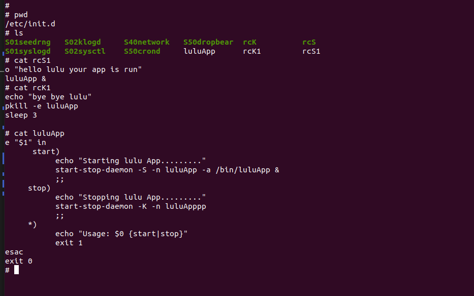
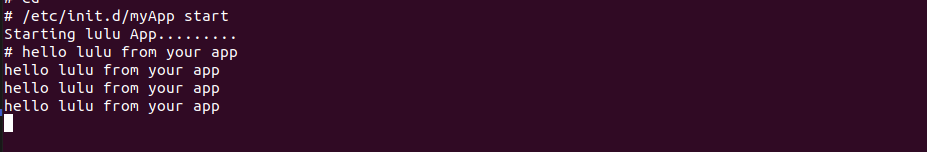
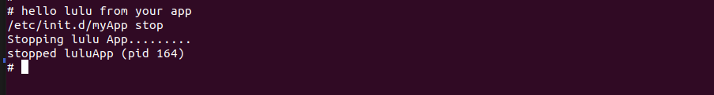
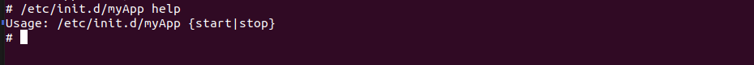
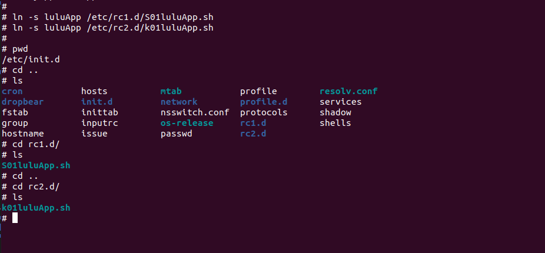

# System V Init
## Task 1 
- Configure buildroot for running sysV with qemu
- ⁠Implement two runlevels , start daemon in one level and kill it when move to another

# Steps 
1. [Configure buildroot](https://github.com/luluehab/Embedded-Linux-New/tree/main/Embedded%20Linux/BuildRoot)

2. run Qemu 
```sh 
cd output/images
./start-qemu.sh 
```

3. Add the application 
```sh
cd /etc/init.d
touch luluApp
```
```sh 
#myApp
#! /bin/sh
case "$1" in
      start)
           echo "Starting lulu App........."
           start-stop-daemon -S -n luluApp -a /bin/luluApp &
           ;;
     stop)
           echo "Stopping lulu App........."
           start-stop-daemon -K -n luluApp
           ;;
     *)
           echo "Usage: $0 {start|stop}"
           exit 1
esac
exit 0

```



4. Add App in /bin 

```sh 
cd /bin
touch luluApp
```sh 
#app
#!/bin/sh

while true 
do 
	echo "hello lulu from your app"
	sleep 5
done
```
4. use the App

```sh 
/etc/init.d/luluApp start
/etc/init.d/luluApp stop
/etc/init.d/luluApp help
```





5. link the App 

```sh
mkdir /etc/rc1.d  
mkdir /etc/rc2.d

#to run app in run level 1
ln -s luluApp /etc/rc1.d/S01luluApp.sh
#to kill app in run level
ln -s luluApp /etc/rc2.d/k01luluApp.sh

```



6. add script tp manage system 
```sh 
touch /etc/init.d/rc
```
```sh
#rc
#!/bin/sh
# Check if one argument is provided
if [ $# -ne 1 ]; then
    echo "Usage: $0 <runlevel>"
    exit 1
fi
# Define the folder path based on the argument
folder="rc$1.d"
# Kill scripts starting with K
for i in /etc/$folder/K??* ;do
     # Ignore dangling symlinks (if any).
     [ ! -f "$i" ] && continue
     case "$i" in
        *.sh)
            # Source shell script for speed.
            (
                trap - INT QUIT TSTP
                set stop
                . $i
            )
            ;;
        *)
            # No sh extension, so fork subprocess.
            $i stop
            ;;
    esac
done
# Start scripts starting with S
for i in /etc/$folder/S??* ;do
     # Ignore dangling symlinks (if any).
     [ ! -f "$i" ] && continue
     case "$i" in
        *.sh)
            # Source shell script for speed.
            (
                trap - INT QUIT TSTP
                set start
                . $i
            )
            ;;
        *)
            # No sh extension, so fork subprocess.
            $i start
            ;;
    esac
done
```
```sh
chmod +x rc
```


7. edit inittab file 
```sh 
# Excute in run level 1
rc1:1:wait:/etc/init.d/rc 1

# Excute in run level 2
rc2:2:wait:/etc/init.d/rc 2
```
8. 