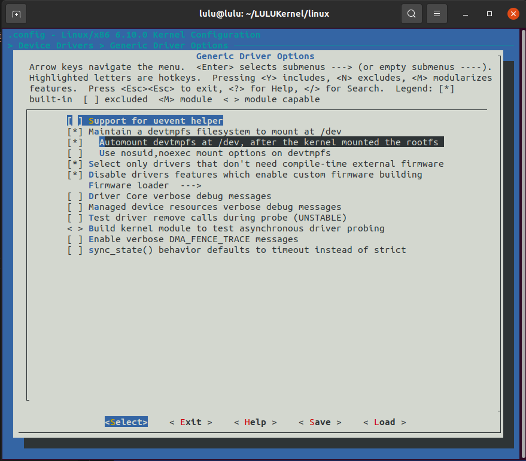

# Linux Kernel 


1. Download Kernel
```sh 
git clone --depth=1 git://git.kernel.org/pub/scm/linux/kernel/git/stable/linux.git
cd linux
```
2. Configure kernel 
```sh 
export CROSS_COMPILE=~/x-tools/arm-cortexa9_neon-linux-musleabihf/bin/arm-cortexa9_neon-linux-musleabihf-
export ARCH=arm
make vexpress_defconfig
make menuconfig
```
- General setup 
    - Kernel compression mode (XZ)
    
    - Local version - append to kernel release 
    
    
- Device Drivers
    - Generic Driver Options
        - select Automount devtmpfs at /dev, after the kernel mounted the rootfs 
        
    

3. Build Kernel 
```sh 
 make -j4 zImage modules dtbs
 ```
 `-j4` 4: This option specifies the number of parallel jobs to run during the build process

 - to see your compiled kernel image
 ```sh 
 make kernelrelease
 ```
 

4. Boot kernel
```sh
sudo qemu-system-arm -M vexpress-a9 -m 128M -nographic -kernel u-boot -sd ~/Desktop/SD_CARD/lulu.img
```
```sh 
lulu=> echo $kernel_addr_r 
0x60100000
lulu=> echo $fdt_addr_r    
0x60000000
#load zimage
lulu=> fatload mmc 0:1 $kernel_addr_r zImage
4074736 bytes read in 751 ms (5.2 MiB/s)
#load Vexpress DTB file
lulu=> fatload mmc 0:1 $fdt_addr_r vexpress-v2p-ca9.dtb
14329 bytes read in 13 ms (1.1 MiB/s)
lulu=> md $fdt_addr_r                                  
60000000: edfe0dd0 f9370000 38000000 58340000  ......7....8..4X
60000010: 28000000 11000000 10000000 00000000  ...(............
60000020: a1030000 20340000 00000000 00000000  ......4 ........
60000030: 00000000 00000000 01000000 00000000  ................
60000040: 03000000 08000000 00000000 2d503256  ............V2P-
60000050: 00394143 03000000 04000000 06000000  CA9.............
60000060: 91010000 03000000 04000000 0e000000  ................
60000070: 0f000000 03000000 22000000 20000000  ..........."... 
60000080: 2c6d7261 70786576 73736572 7032762c  arm,vexpress,v2p
60000090: 3961632d 6d726100 7865762c 73657270  -ca9.arm,vexpres
600000a0: 00000073 03000000 04000000 2b000000  s..............+
600000b0: 01000000 03000000 04000000 3c000000  ...............<
600000c0: 01000000 03000000 04000000 4b000000  ...............K
600000d0: 01000000 01000000 40737562 30303034  ........bus@4000
600000e0: 30303030 00000000 03000000 0b000000  0000............
600000f0: 20000000 706d6973 622d656c 00007375  ... simple-bus..
lulu=> md $kernel_addr_r 
60100000: e1a00000 e1a00000 e1a00000 e1a00000  ................
60100010: e1a00000 e1a00000 e1a00000 e1a00000  ................
60100020: ea000005 016f2818 00000000 003e2cf0  .....(o......,>.
60100030: 04030201 45454545 000065f0 e10f9000  ....EEEE.e......
60100040: eb000da6 e1a07001 e1a08002 e10f2000  .....p....... ..
60100050: e3120003 1a000001 e3a00017 ef123456  ............V4..
60100060: e10f0000 e220001a e310001f e3c0001f  ...... .........
60100070: e38000d3 1a000004 e3800c01 e28fe00c  ................
60100080: e16ff000 e12ef30e e160006e e121f000  ..o.....n.`...!.
60100090: e16ff009 00000000 00000000 00000000  ..o.............
601000a0: e1a0000f e200033e e28f1c02 e591d000  ....>...........
601000b0: e08dd001 e1a01008 eb0017a9 e2804902  .............I..
601000c0: e1a0000f e1500004 359f01e8 3080000f  ......P....5...0
601000d0: 31540000 33844001 2b000078 e28f0f73  ..T1.@.3x..+s...
601000e0: e590d000 e5906004 e08dd000 e0866000  .....`.......`..
601000f0: e28f9f71 e599a000 e08aa009 e5da9000  q...............
```

5. Boot The zImage and Vexpress DTB file
```sh 
bootz $kernel_addr_r - $fdt_addr_r

```

```sh 
lulu=> bootz $kernel_addr_r - $fdt_addr_r
Kernel image @ 0x60100000 [ 0x000000 - 0x3e2cf0 ]
## Flattened Device Tree blob at 60000000
   Booting using the fdt blob at 0x60000000
Working FDT set to 60000000
   Loading Device Tree to 66b0d000, end 66b137f8 ... OK
Working FDT set to 66b0d000

Starting kernel ...
```
then 
