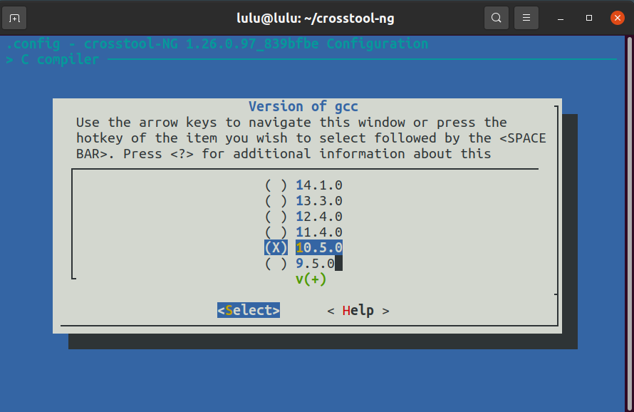
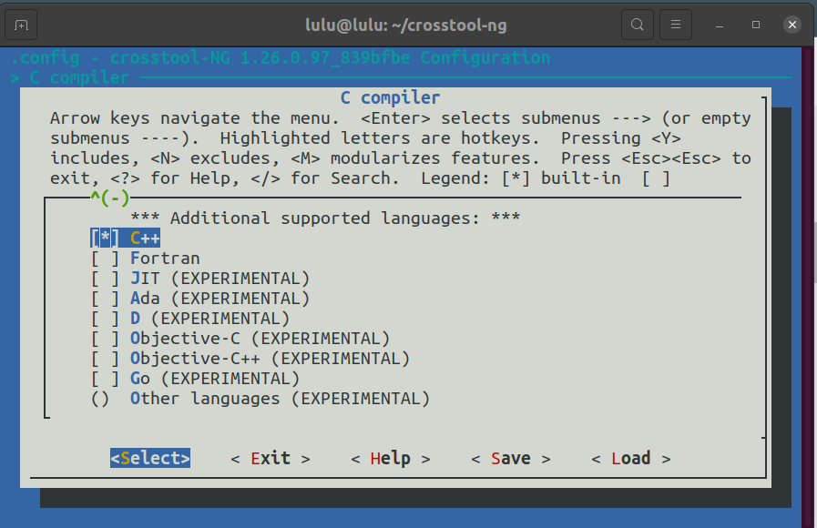
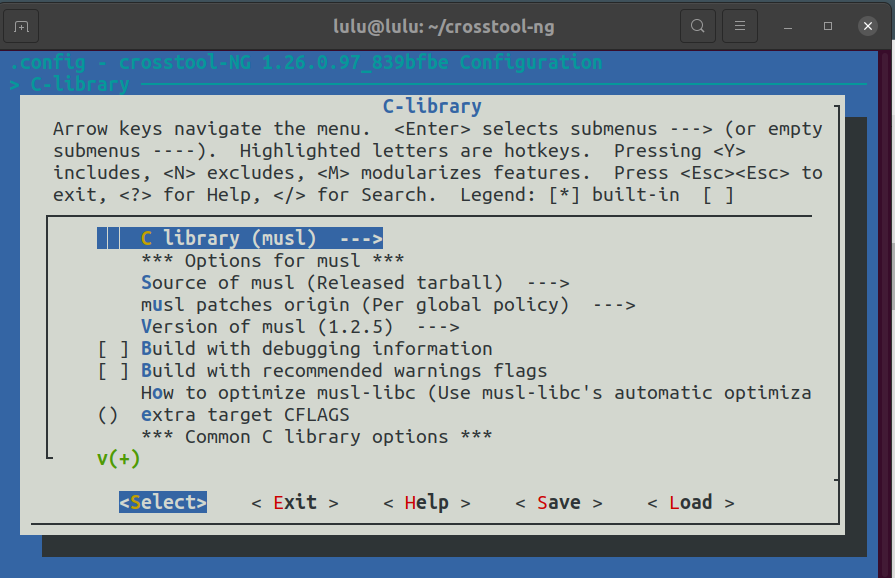
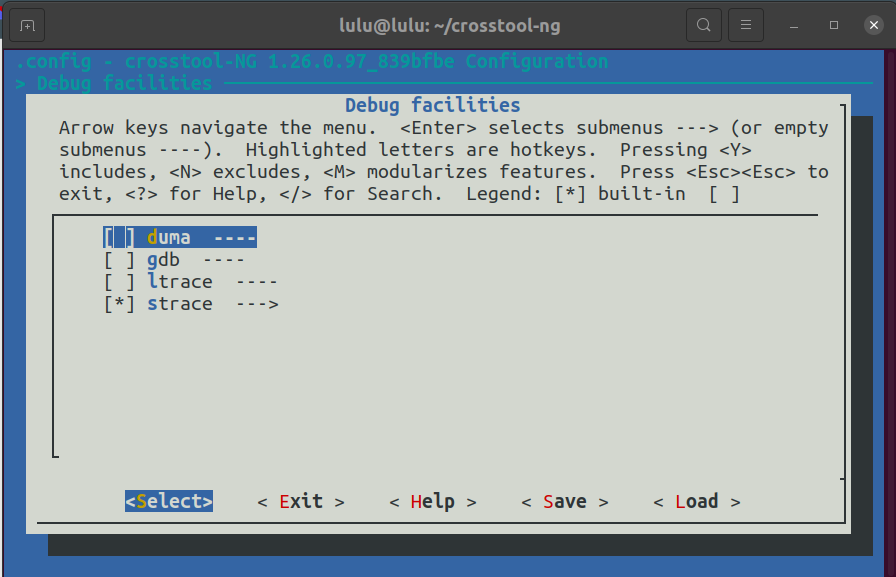
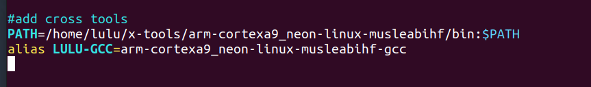
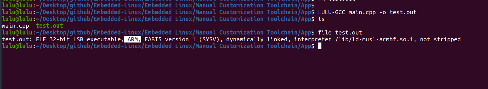

# CrossTool-NG Setup Guide

## Pre-requisites

Install the necessary dependencies:

```sh
sudo apt-get install autoconf automake bison bzip2 cmake
sudo apt-get install flex g++ gawk gcc gettext git gperf help2man
sudo apt-get install libncurses5-dev libstdc++6 libtool libtool-bin make
sudo apt-get install patch python3-dev rsync texinfo unzip wget xz-utils
```

## git crosstool-ng repo 

```sh 
git clone https://github.com/crosstool-ng/crosstool-ng.git
cd crosstool-ng 
./bootstrap
./configure --enable-local
make 
./ct-ng //(final result)
./ct-ng list-samples //(show all targets)
./ct-ng list-samples  | grep a9 //(my target)
./cn-ng Copycortex a9
./ct-ng menuconfig
```
### my configure
- c compiler 
    -  version of gcc =>  change version of gcc as yours-(10.5.0)
    - check c++ as additional supported language


- c library =>  musl


- debug facilities => strace



```sh
make
./ct-ng build
```
 OR 
 ```sh 
 ./ct-ng build.(no of threads)(default 1) 
 ```

## in .bashrc


## run project 

