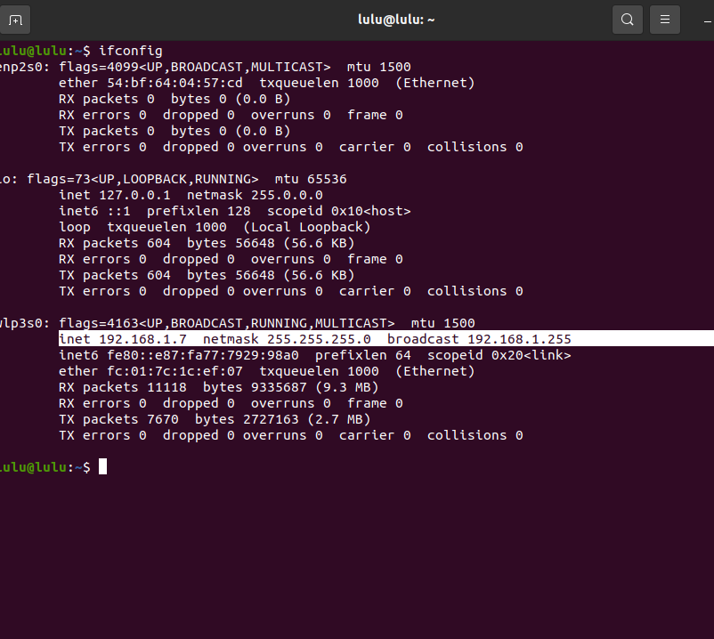
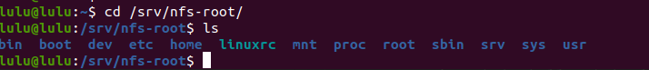
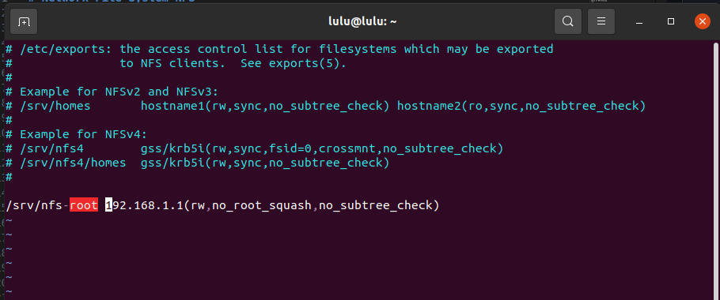
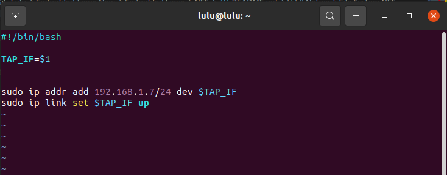
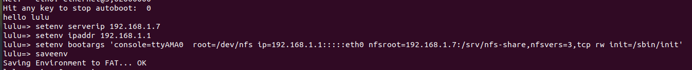
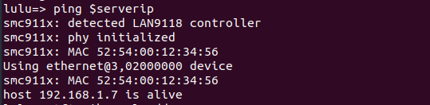
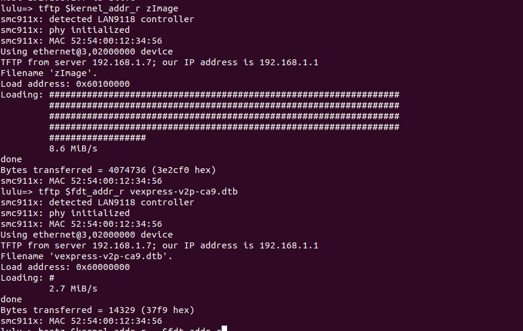
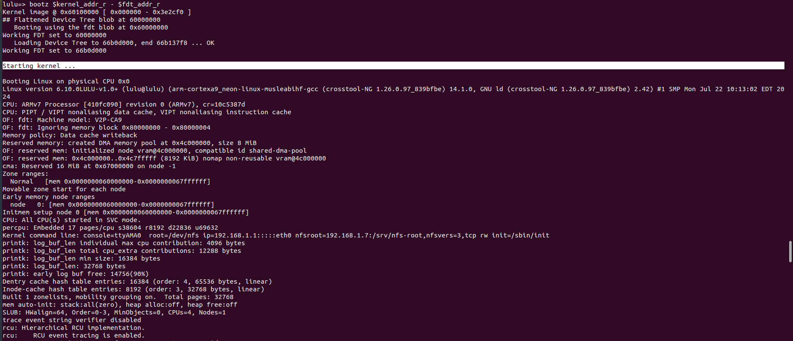
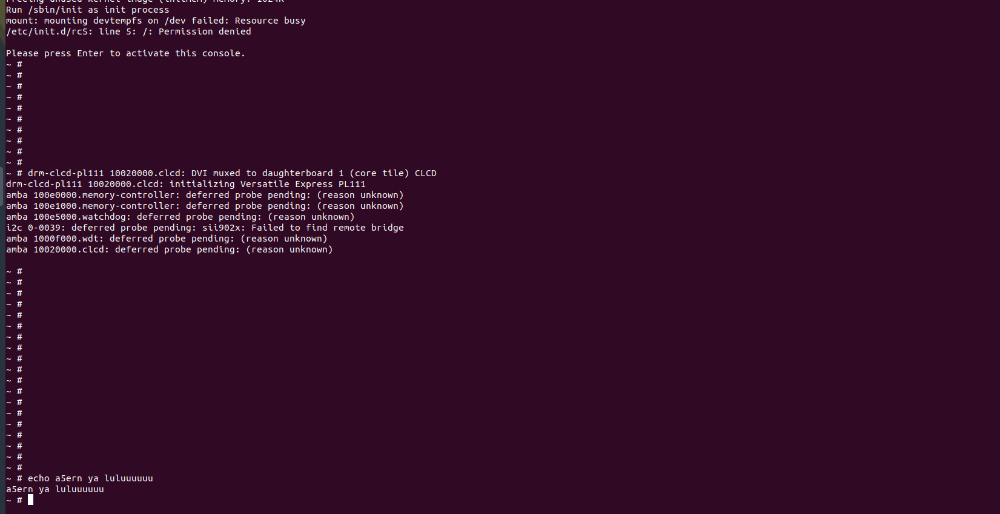

# Network File System NFS

1. install NFS 
```sh 
sudo apt install nfs-kernel-server
```
- Check If NFS Running
```sh
systemctl status nfs-kernel-server
```
- install net-tool package
```sh
sudo apt install net-tools
```
2. know ip address (server)
```sh 
ifconfig
```
here my ip address is 192.168.1.7


2. make nfs-root directory
```sh
mkdir /srv/nfs-root
```
- copy muRootfs into this directory
```sh
sudo cp -rp /media/lulu/rootfs/* /srv/nfs-root
```

3. configuration
```sh
sudo vi  /etc/exports
```
```sh 
/srv/nfs-root 192.168.1.1(rw,no_root_squash,no_subtree_check)
                                                                 
```


4. edit virtual network script 


5. Restart NFS
```sh
sudo systemctl restart nfs-kernel-server
```
5. Run Qemu 
```sh
sudo qemu-system-arm -M vexpress-a9 -m 128M -nographic -kernel u-boot -sd ../SD_CARD/lulu.img -net nic -net tap,script=./bash.sh 
```

6. set environment 
```sh
setenv serverip 192.168.1.7
setenv ipaddr 192.168.1.1
setenv bootargs 'console=ttyAMA0  root=/dev/nfs ip=192.168.1.1:::::eth0 nfsroot=192.168.1.7:/srv/nfs-root,nfsvers=3,tcp rw init=/sbin/init'
saveenv

```


7. check connection
```sh 
ping $serverip
```

7. Load the Kernel and DTB file

```sh
tftp $kernel_addr_r zImage
tftp $fdt_addr_r vexpress-v2p-ca9.dtb
```

8. boot the Kernel and DTB file
```sh 
bootz $kernel_addr_r - $fdt_addr_r
```


