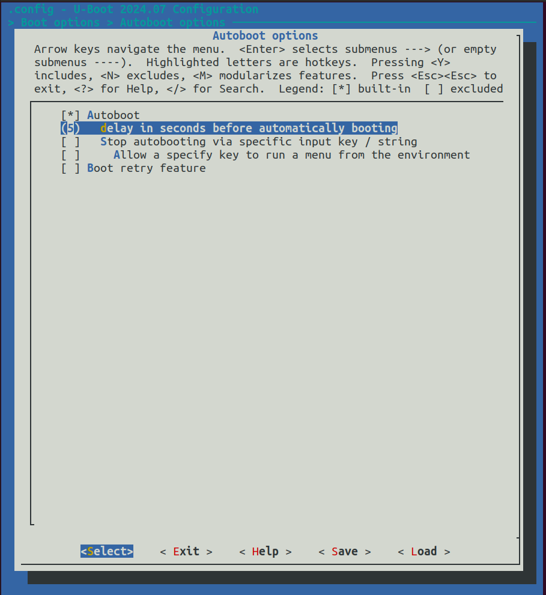
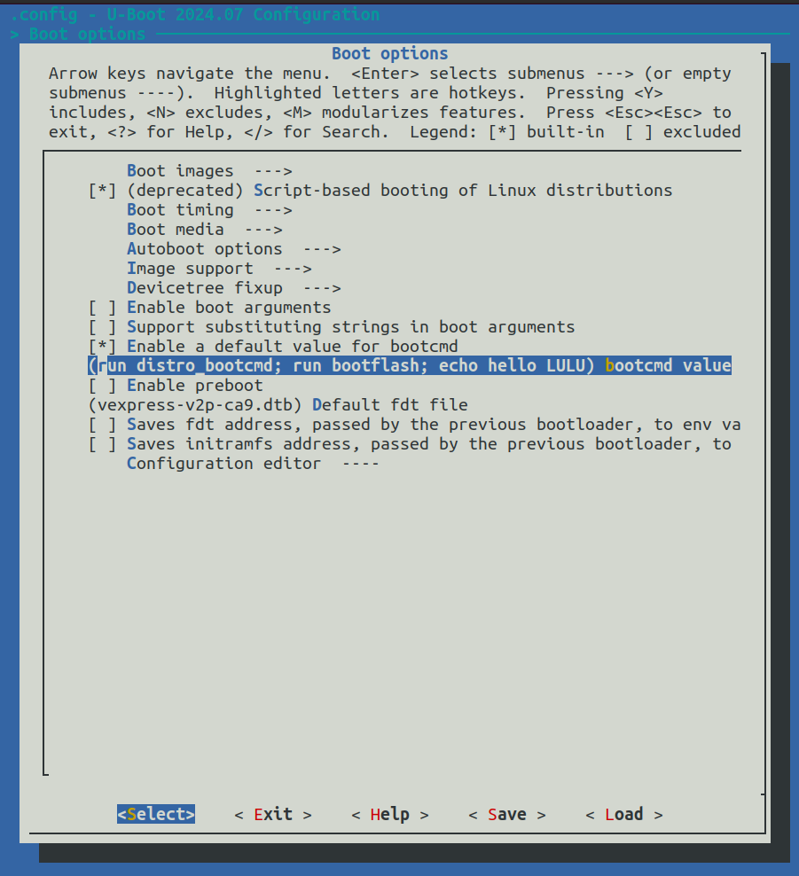
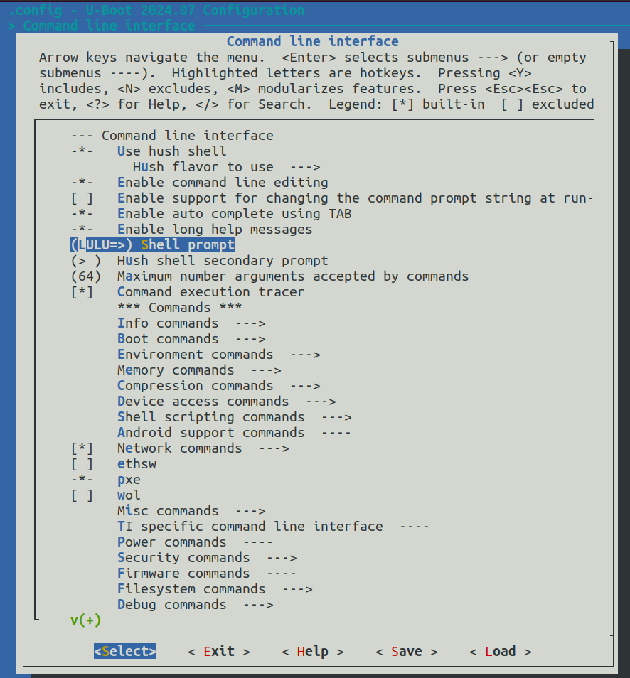
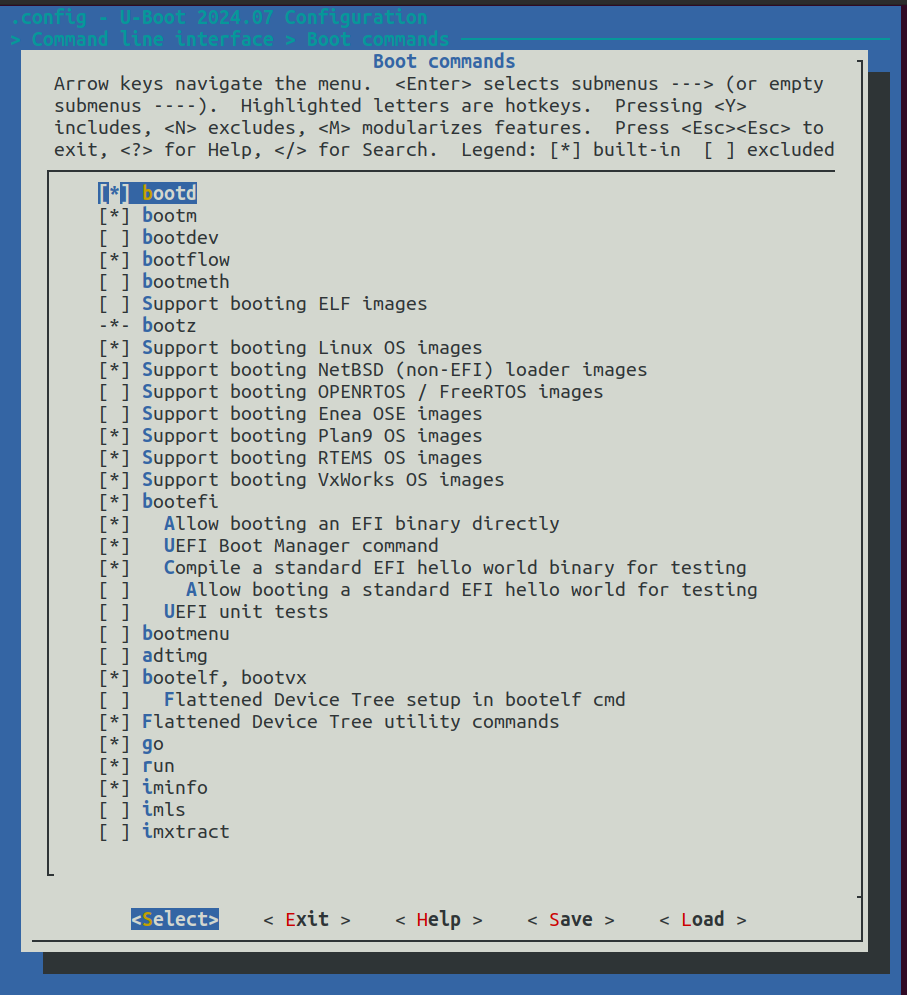
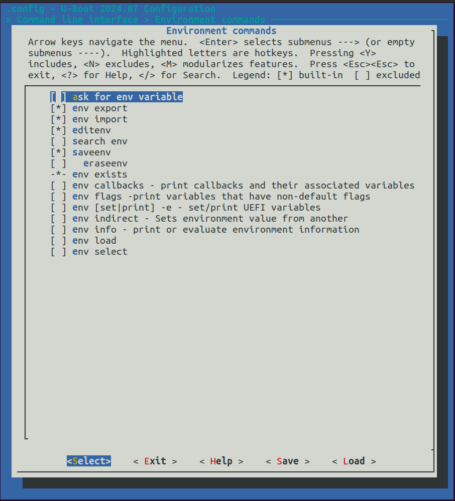
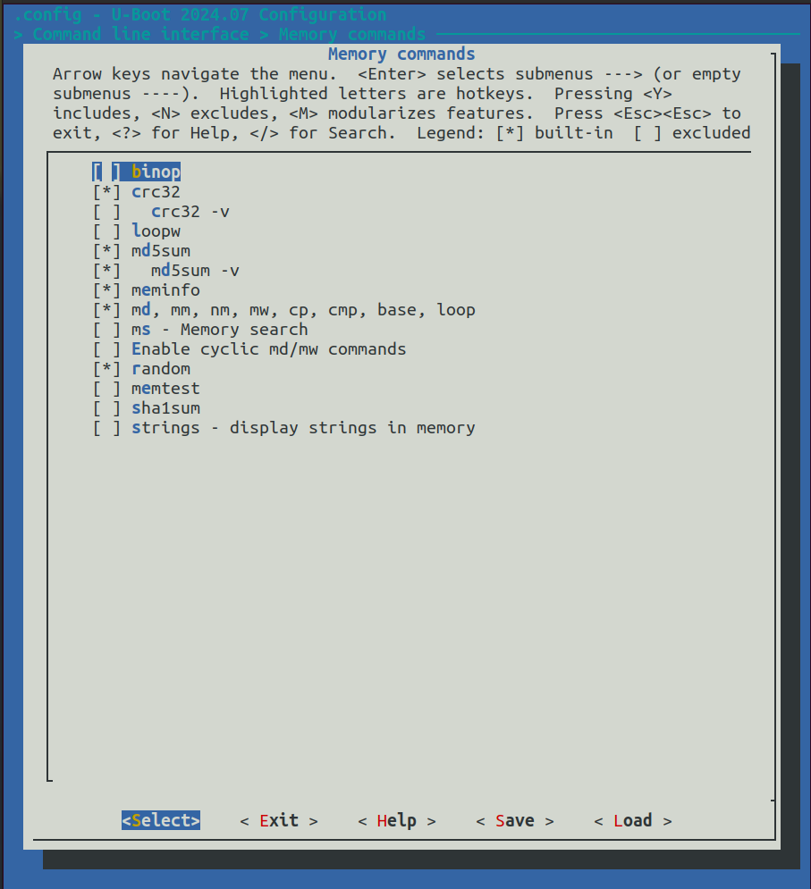
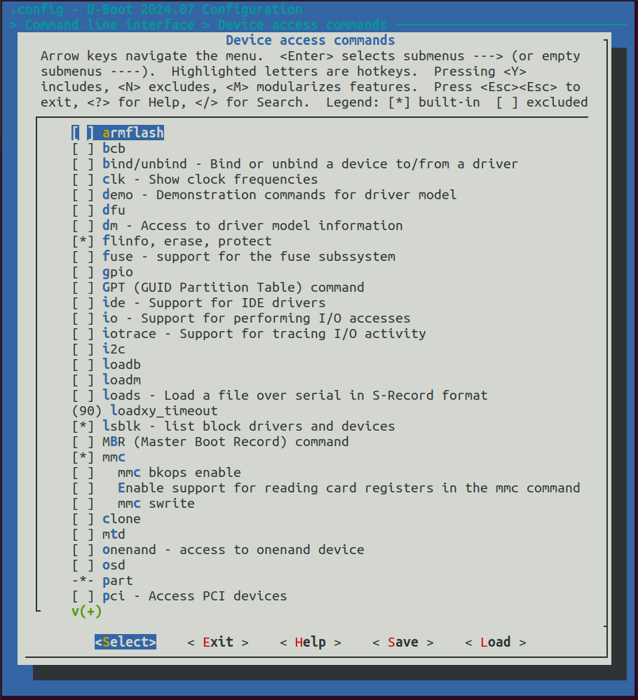
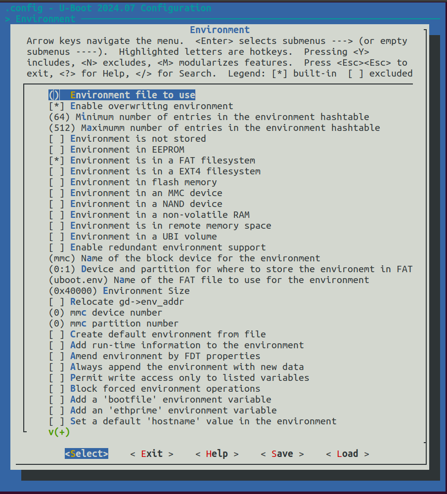
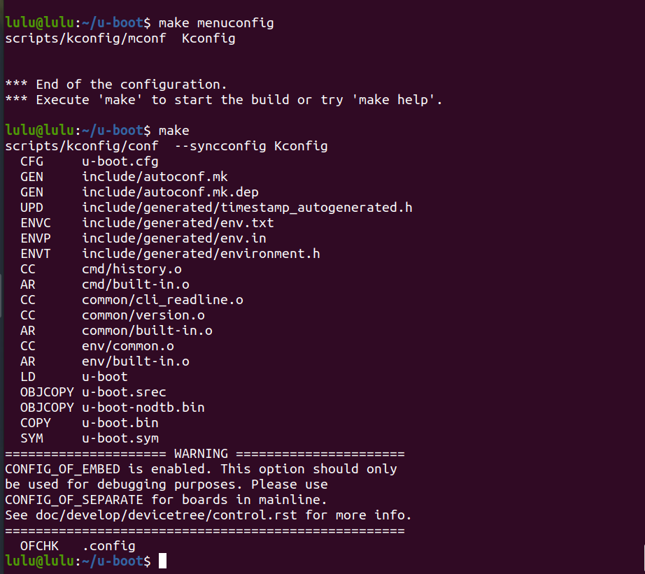
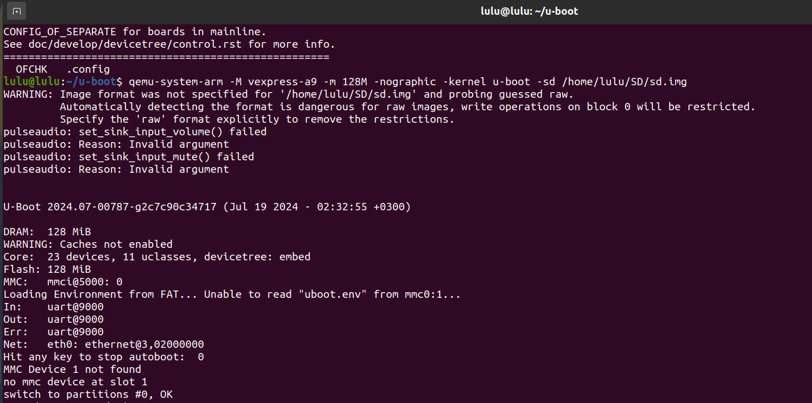

# U-boot (Bootloader)

## git u-boot repo 

```sh 
git clone git@github.com:u-boot/u-boot.git
cd u-boot/
```

## search for my target 

```sh 
ls config | grep vexpress_ca9x4_defconfig
```

## Set cross compiler into environment variables CROSS_COMPILE to enable U-boot to use it

```sh
cat Makefile | grep CROSS
export CROSS_COMPILE=~/x-tools/arm-cortexa9_neon-linux-musleabihf/bin/arm-cortexa9_neon-linux-musleabihf-
```
## Specify the architecture of the target to be ARM architecture
```sh  
export ARCH=arm
```


```sh
 make vexpress_ca9x4_defconfig
 make
 make menuconfig
```
# configration 

1. Autoboot options
-delay in secont betore automatically booting
 

2. Boot option 
- bootcmd valu: first thing run after auto boot 


3. Command line interface 
- shell prompt
 

- boot command 
    - add bootd, run


- environment command
    - add editenv, saveenv


- memory command 
    - add md5sum,md5sum -v, meminfo


- device access command 
    - add lsblk - list block drivers and devices 


4. Environment 
    - select Environment is in a FAT filesystem
    - Device and partition for where to store the environment 
        - Configure the partition where the fat is store to 0:1 
    - un select Environment is in flash memory




## Build Boot

```sh 
make 
```



##Test U-boot using Qemu emulator

