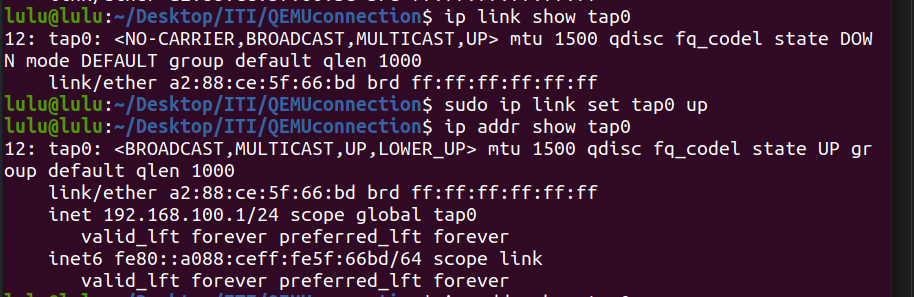
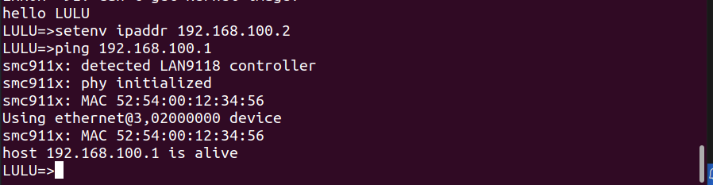

#  create a virtual communication between QEMU and an x86 machine

1. make sure you have necessary networking tools installed
```sh
sudo apt-get install qemu-system-arm bridge-utils
```

2. Create and configure a TAP interface script:

```sh 
#!/bin/bash

TAP_IF="tap0"

ip link delete $TAP_IF 2>/dev/null
ip tuntap add dev $TAP_IF mode tap
sudo ip addr add 192.168.100.1/24 dev $TAP_IF
sudo ip link set $TAP_IF
                
```

3. Make the script executable:
```sh
chmod +x myscript
```

4. Run the script:

```sh 
sudo ./setup_tap.sh
```

5. Make sure that the TAP interface is correctly configured and running on your host machine.

```sh 
ip link show tap0
ip addr show tap0
```
- if 



5.  Run QEMU

```sh
sudo qemu-system-arm -M vexpress-a9 -m 128M -nographic -net nic -net tap,script=script_path -kernel u-boot_path
```
- if it not wark try this

```sh 
 sudo qemu-system-arm -M vexpress-a9 -m 128M -nographic -net nic -net tap,ifname=tap0,script=no -kernel u-boot 
```

6. set ipaddr of Qemu with same network 
```sh
setenv ipaddr 192.168.100.2
ping 192.168.100.1
```
