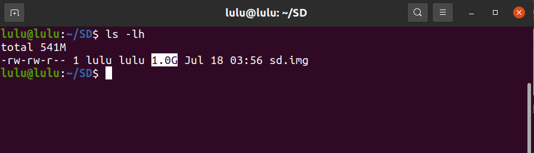
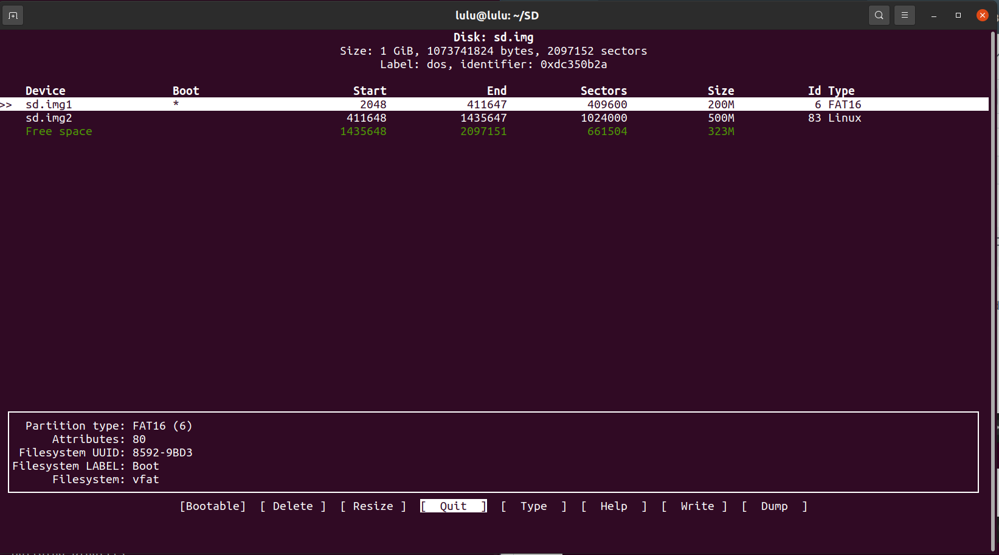
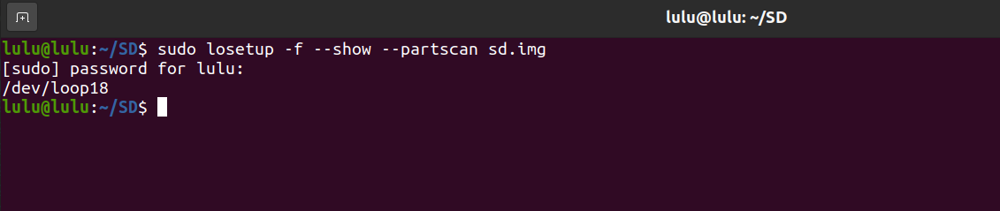
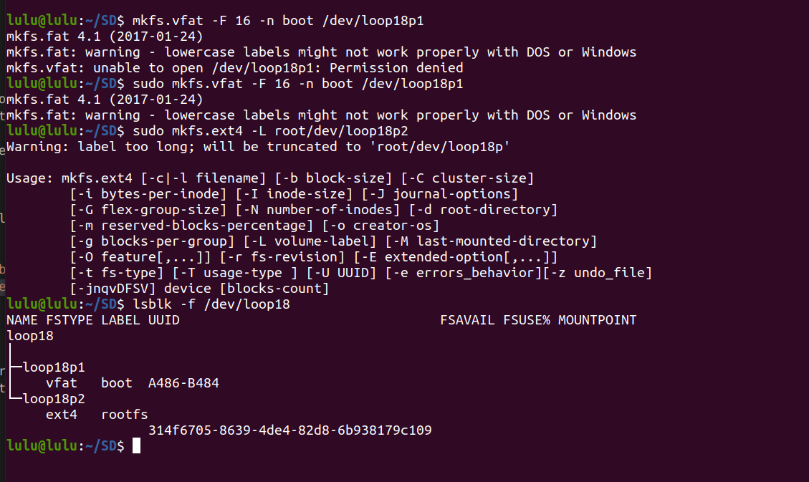

# How to creat virtual SD card 
 1. creat file called sd.img with size 1G 
 ```sh 
 dd if=/dev/zero of=sd.img bs=1M count=1024
 ```
- dd: disk/data duplicator 
- if: input file 
- of: output file
- bs: block size 
- count: number of blocks 



2. configure the partitions of our SD card
- cfdisk create parition table

```sh 
cfdisk sd.img
```
    1. boot 
        - size:200 MB
        - primary
        - Type format: FAT 16 
        - bootable 
        - write
    2. root 
        - size:500 MB
        - extended
        - format: EXT4 (linux)
        - write



3. Emulate the sd.img as a Block storage

```sh 
    losetup -f -- show - -partscan sd.img
```

        - f:find empty loop
        - show: display the name of the loop device that is associated.
        - partscan: to see the HEADER (meta data)



4.  inject file system algorithm 

```sh
     mkfs.vfat -F 16 -n boot /dev/loop18p1
     mkfs.ext4 -L rootfs /dev/loop18p2
```
        - -F 16 >> fat16
        - -L name root
        - -n name boot
        - /dev/loop: Represents partition on the block device
        - now the algorithm in sd card

-  to check if correct
```sh   
     lsblk -f c
```


5. Mount The Virtual SD Card
```sh 
cd ~
mkdir boot 
mkdir rootfs
$ sudo mount /dev/loop18p1 ~/boot
$ sudo mount /dev/loop18p2 ~/rootfs
```

