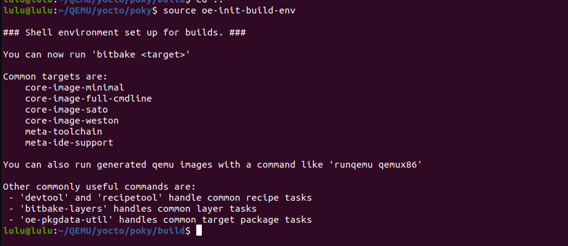
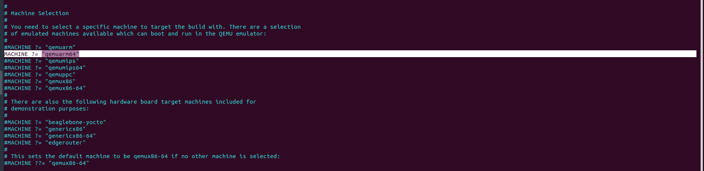
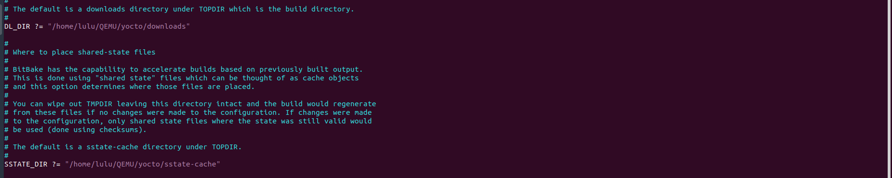
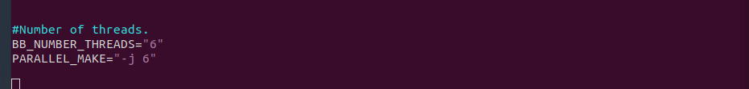
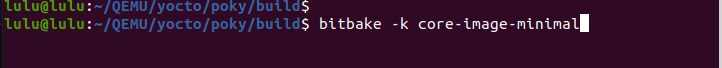
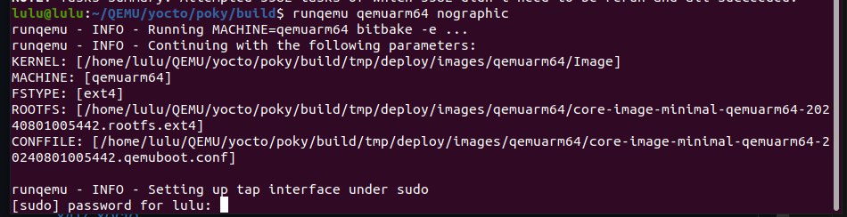
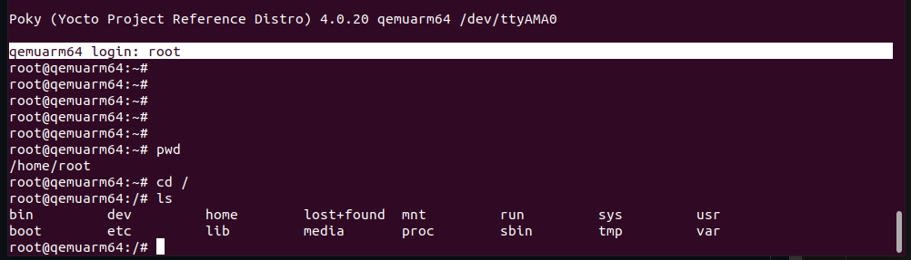

# Yocto Setup Guide

## Pre-requisites

Install the necessary dependencies:
```sh 
sudo apt-get install gawk wget git-core diffstat unzip texinfo gcc-multilib build-essential chrpath socat cpio  python3 python3-pip python3-pexpect 
```

## git Yocto repo 
```sh
git clone -b kirkstone https://git.yoctoproject.org/git/poky.git
```
## setup environment 
```sh
cd poky
source oe-init-build-env
```


### my configure
```sh 
vi conf/local.conf
```
change target,Download directory, shared state files directory and set number of threads 




## Build yocto 
```sh 
bitbake -k core-image-minimal
```



## Run QEMU
```sh
runqemu qemuarm64 nographic
```


