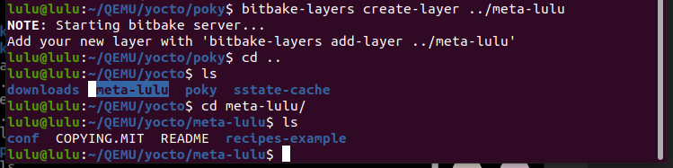
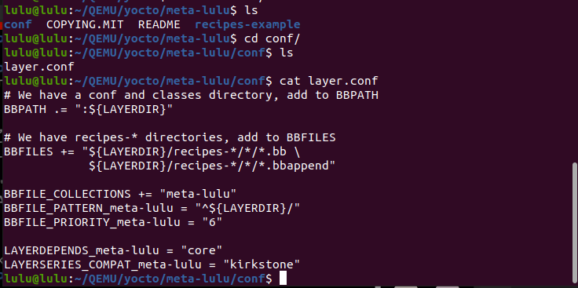
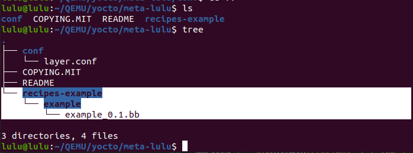
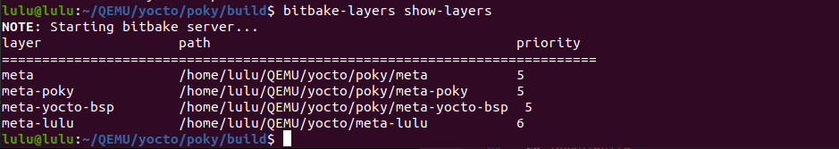
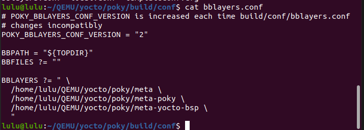
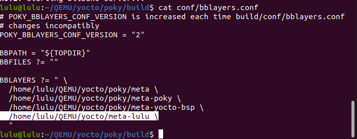
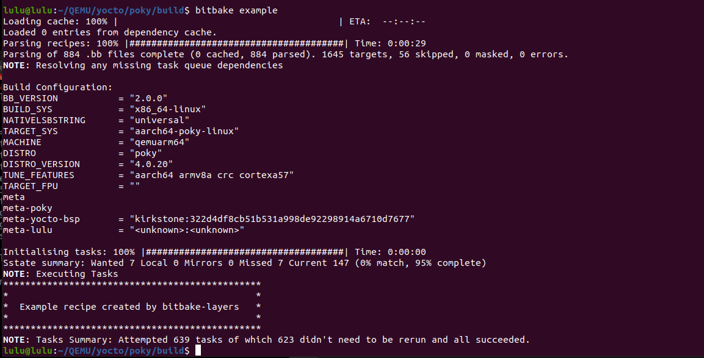

# Create Layer 
## Steps 
1. create layer template by poky
```sh
bitbake-layers create-layer <path - outside poky>
```


#### explain conf directory 
- it has all .conf files (layer.conf)



```sh
# layer name 
BBFILE_COLLECTIONS += "meta-lulu"
```
```sh
#Priority of layer
BBFILE_PRIORITY_meta-lulu = "6"
```
```sh
# We have recipes-* directories, add to BBFILES 
# how to find .bb & .bbappend files in recipe 
BBFILES += "${LAYERDIR}/recipes-*/*/*.bb \
            ${LAYERDIR}/recipes-*/*/*.bbappend"
```


```sh 
# We have a conf and classes directory, add to BBPATH
BBPATH .= ":${LAYERDIR}"
```

```sh 
BBFILE_PATTERN_meta-lulu = "^${LAYERDIR}/"
```
```sh
#depends on another layer (Core is a meta(open embedded))
LAYERDEPENDS_meta-lulu = "core"
```
```sh
# compatible version 
LAYERSERIES_COMPAT_meta-lulu = "kirkstone"
```

###### to show all layer 
```sh 
bitbake-layers show-layers
```


2. add layer to build
- bblayers.conf file (only one) has all layers that you need in build 

```sh 
cd poky/build/conf
cat bblayers.conf
```

###### you can add by two way 

- edit in this file and include your recipe 
- should be absolute path 
```sh
BBLAYERS ?= " \
  /home/lulu/QEMU/yocto/poky/meta \
  /home/lulu/QEMU/yocto/poky/meta-poky \
  /home/lulu/QEMU/yocto/poky/meta-yocto-bsp \
  /home/lulu/QEMU/yocto/meta-lulu  \
  "
```

- by poky 
```sh
bitbake-layers add-layer  <path>
```
 


3. to run recipe 
```sh
cd /poky/build
#bitbake recipename(.bb file)
bitbake example 
```



