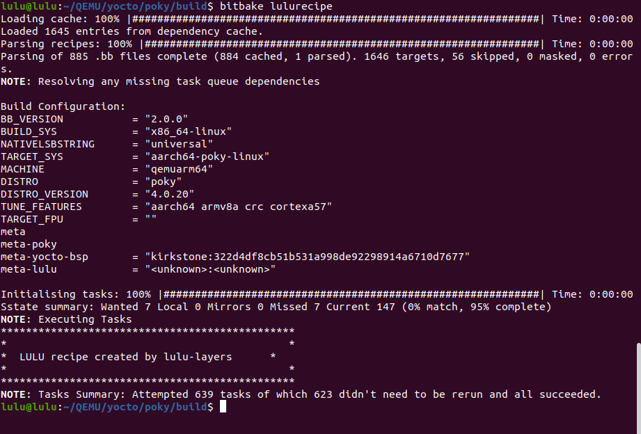

# Create recipe 
## Steps 

1. create recipe in /meta-layer/recipes-example (where bitbake search in)

```sh 
cd /meta-layer/recipes-example
mkdir lulu_recipe
touch /lulu_recipe/lulurecipe_1.0.bb 
```

```sh
# in .bb file 

DESCRIPTION = "Recipe created by lulu"
LICENSE = "MIT"

python do_display_banner() {
    bb.plain("***********************************************");
    bb.plain("*                                             *");
    bb.plain("*  LULU recipe created by lulu-layers      *");
    bb.plain("*                                             *");
    bb.plain("***********************************************");
}

addtask display_banner before do_build


```

2. make sure layer existed
```sh
bitbake-layers show-layers
```
3. make sure layer added in bblayers.conf
```sh
cat conf/bblayers.conf 
```


4. build recipe 
```sh
bitbake lulurecipe
```




# Task 
check global variable and print based on it 

- edit into bblayers.conf
```sh 
DESCRIPTION = "Recipe created by lulu"
LICENSE = "MIT"

python do_display_banner() {
    bb.plain("***********************************************");
    bb.plain("*                                             *");
    bb.plain("*  LULU recipe created by lulu-layers         *");
    bb.plain("*                                             *");
    bb.plain("***********************************************");

    # Retrieve the value of the global variable
    # The d.getVar('MY_GLOBAL_VAR') function retrieves the value of the MY_GLOBAL_VAR variable.
    global_var = d.getVar('MY_GLOBAL_VAR')

    # Check the value of the global variable and print the corresponding message
    if global_var == "0":
        bb.plain("hi lulu")
    elif global_var == "1":
        bb.plain("hello ya lulu")
    else:
        bb.plain(f"Unknown value for MY_GLOBAL_VAR: {global_var}")

}

addtask display_banner before do_build

```

- set global variable in layer.conf


- Build recipe 
```sh
bitbake lulurecipe
```


- edit variable 


- edit variable 


