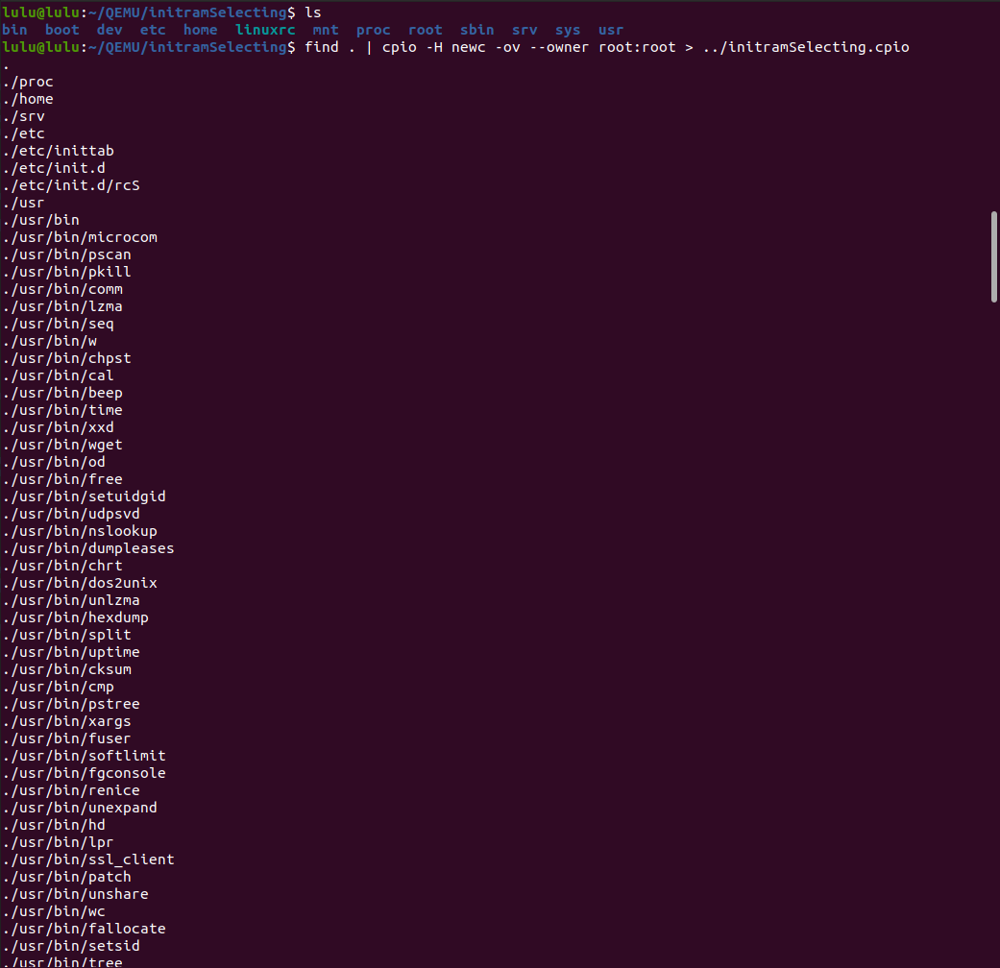

# Initramfs task
- We have initramfs image running above 2 rootfs and the kernel will firstly load the initramfs, Which has a script doing a boot manager job. The script is gonna ask the user which rootfs to be loaded
1 or 2
- If the user choise 1 then root file system from virtual sd card  will be loadded
- If the user choose 2 then root file system from nfs server 


## Steps


1. make directory 

```sh 
mkdir initramSelecting
```
2. copy our file system into directory 
```sh
sudo cp -rp /media/lulu/rootfs/* QEMU/initramSelecting/
```
3. make sure root is the owner
- to change owner 
```sh
 sudo chown -R root:root *
```


4. create our init script to dual booting 
```sh
sudo vi sbin/chooseRoot.sh
```
```sh
#!/bin/sh

echo "Choose the root file system source:"
echo "1) SD card"
echo "2) NFS "

read -p "Enter your choice (1 OR 2): " ch

case $ch in
    1)
        echo "mounting root file system from Virtual SD card..."
        newRoot="/dev/mmcblk0p2"
        ;;
    2)
        echo "mounting root file system from NFS server..."
        newRoot="nfs-server:/srv/nfs-root"
        ;;
    *)
        echo "invalid choice, Defaulting to Virtual SD card."
        newRoot="/dev/mmcblk0p2"
        ;;
esac

echo "Switching................."
chroot "$newRoot" /sbin/init

```

5. change permission to be executable 

```sh 
sudo chmod +x chooseRoot.sh
```


6. create cpio archive 
```sh 
find . | cpio -H newc -ov --owner root:root > ../initramSelecting.cpio
```


7. compress the archived files 
```sh
cd .. 
gzip initramSelecting.cpio
```


8. make image 
```sh 
 mkimage -A arm -O linux -T ramdisk -d initramSelecting.cpio.gz Dualbootingramfs
```


9. copy image into boot partition of virtual SD card
```sh 
 sudo cp Dualbootingramfs /media/lulu/boot/

```


10. Run QEMU
```sh 
sudo qemu-system-arm -M vexpress-a9 -m 128M -nographic -kernel u-boot -sd ../SD_CARD/lulu.img -net nic -net tap,script=./bash.sh 
```

11. set environments 
```sh
setenv serverip 192.168.1.7
setenv ipaddr 192.168.1.1
setenv initRamfs_addr 0x60700000
fatload mmc 0:1 $kernel_addr_r zImage
fatload mmc 0:1 $fdt_addr_r vexpress-v2p-ca9.dtb
fatload mmc 0:1 $initRamfs_addr Dualbootingram
setenv bootargs console=ttyAMA0,115200 rdinit=/bin/sh

setenv bootargs console=ttyAMA0,115200 rdinit=/etc/init.d/choose_root_fs.sh


saveenv
bootz $kernel_addr_r $initRamfs_addr $fdt_addr_r
```
- Check connection 
```sh
ping $serverip

```


setenv bootargs console=ttyAMA0,115200 root=/dev/mmcblk0p2 rootfstypes=ext4 rw root rdinit=/bin/sh

setenv bootargs console=ttyAMA0,115200 root=/dev/mmcblk0p2 rootfstypes=ext4 rw root init=/bin/sh
