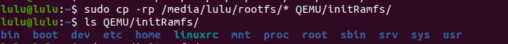
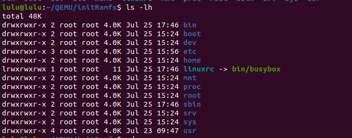
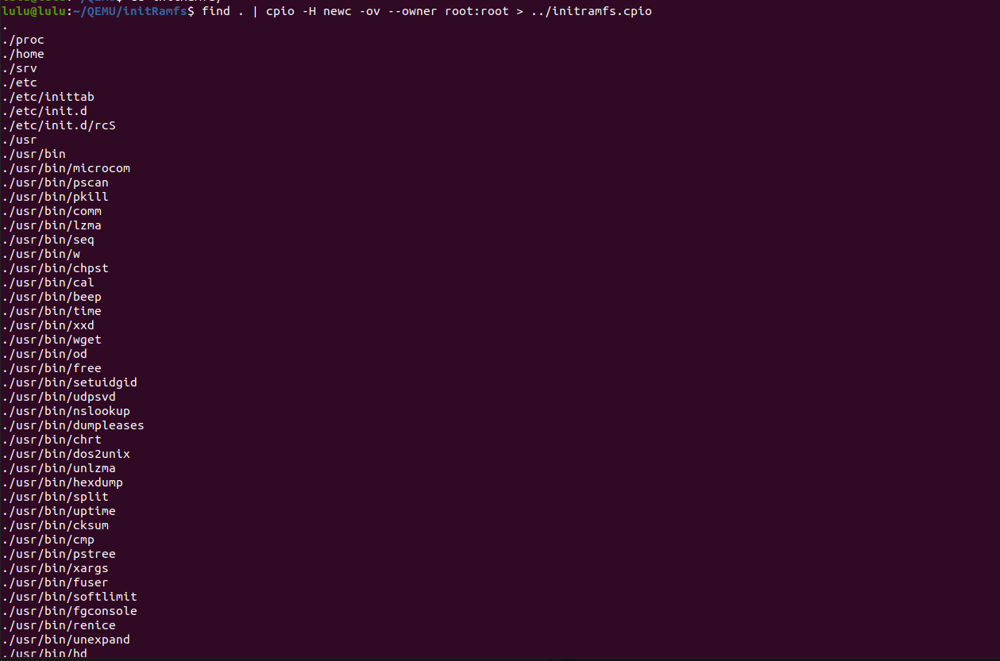
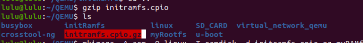
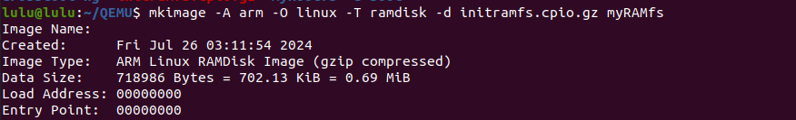
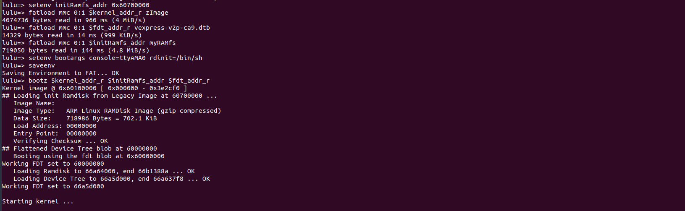
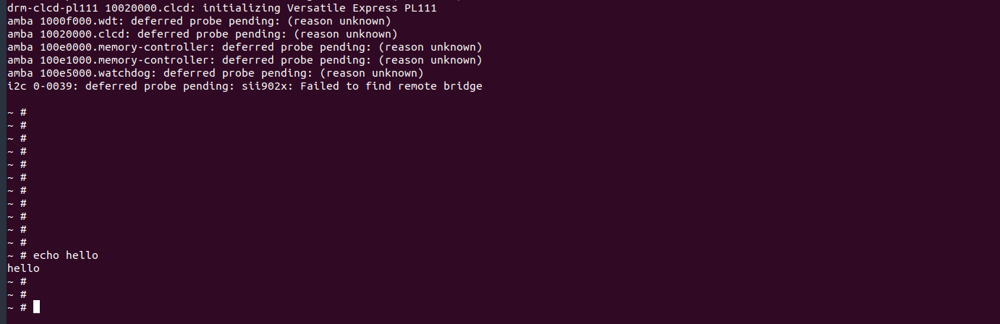

# Initial RAM filesystem
### Create initRamfs Steps 

1. make directory 

```sh 
mkdir initRamfs
```
2. copy our file system into directory 
```sh
sudo cp -rp /media/lulu/rootfs/* QEMU/initRamfs/
```


3. make sure root is the owner
- to change owner 
```sh
 sudo chown -R root:root *
```


4. create cpio archive 
```sh 
find . | cpio -H newc -ov --owner root:root > ../initramfs.cpio
```


5. compress the archived files 
```sh
cd .. 
gzip initramfs.cpio
```


6. make image 
```sh 
 mkimage -A arm -O linux -T ramdisk -d initramfs.cpio.gz myRAMfs
```

7. copy image into boot partition of virtual SD card
```sh 
 sudo cp myRAMfs /media/lulu/boot/

```

8. Run QEMU
```sh
sudo qemu-system-arm -M vexpress-a9 -m 128M -nographic -kernel u-boot -sd ../SD_CARD/lulu.img 

```

9. set environments 
```sh
setenv initRamfs_addr 0x60700000
fatload mmc 0:1 $kernel_addr_r zImage
fatload mmc 0:1 $fdt_addr_r vexpress-v2p-ca9.dtb
fatload mmc 0:1 $initRamfs_addr myRAMfs
setenv bootargs console=ttyAMA0 rdinit=/bin/sh

saveenv
bootz $kernel_addr_r $initRamfs_addr $fdt_addr_r
```



