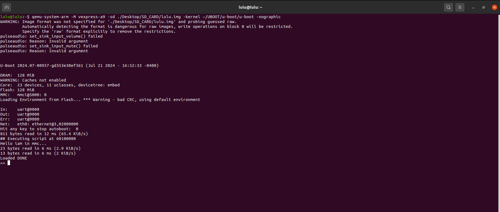

# load file into RAM 
### Steps
- [creat virtual SD card](https://github.com/luluehab/Embedded-Linux-New/tree/main/Embedded%20Linux/Virtual%20SD%20Card)
- copy the file into boot partition 
```sh 
cp LULU.txt /media/lulu/boot
```
- Run Qemu with U-Boot and Virtual SD card
```sh 
qemu-system-arm -M vexpress-a9 -sd ./Desktop/SD_CARD/lulu.img -kernel ~/UBOOT/u-boot/u-boot -nographic

```

- Load file from SD card into RAM
```sh 
fatload mmc 0:1 $fdt_addr_r fileName
md $fdt_addr_r
```


# checking Options (SD card - tftp - no option) 

- write u-boot text file 

```sh
setenv flag 0

for option in mmc tftp nooption; do

    if test "$option" = "mmc"; then
        echo "Hello iam in mmc..."
        if fatload mmc 0:1 $kernel_addr_r zimage && fatload mmc 0:1 $fdt_addr_r LULU.txt; then
            echo "Loaded DONE"
            setenv flag 1
        else
            echo "mmc failed"
        fi
    fi

    if test "$flag" -eq 0 && test "$option" = "tftp"; then
        setenv ipaddr 192.168.100.2
        echo "hello iam in TFTP..."
        if ping 192.168.100.1; then
            echo "Loaded DONE"
            setenv flag 1
        else
            echo "TFTP failed"
        fi
    fi

    if test "$flag" -eq 0 && test "$option" = "nooption"; then
        echo "Sorry there is NO OPTION"
    fi

done

```

- Creating a U-Boot image 

```sh 
mkimage -T script -n "Bootscript" -C none -d loading.txt bootingScript
```
In this example:
    - T kernel: The image type is a kernel.
    - C none: No compression is used.
    - n "Bootscript": The image name is "Bootscript".
    - d loading.txt: The input data file.
    - Bootingscript: The output image file.

- copy the image into boot partition
```sh
cp bootingScript /media/lulu/boot/
```


- Edit Bootcmd value in QEMU

```sh 
setenv bootcmd 'fatload mmc 0:1 ${loadaddr} bootingScript; source ${loadaddr}'
saveenv
reset
```

- Run QEMU in all options 

1. with SD card
 
```sh
qemu-system-arm -M vexpress-a9 -sd ./Desktop/SD_CARD/lulu.img -kernel ~/UBOOT/u-boot/u-boot -nographic

```
with two files 


without zimage


2. network 

```sh 
qemu-system-arm -M vexpress-a9 -sd ./Desktop/SD_CARD/lulu.img -net nic -net tap,ifname=tap0,script=no -kernel ~/UBOOT/u-boot/u-boot -nographic

```


```sh
sudo ip link set tap0 down
```


3. no option 


 
```sh
qemu-system-arm -M vexpress-a9 -kernel ~/UBOOT/u-boot/u-boot -nographic

```
- there is no sd card to load boot script 


## bootflow scan Command 

```sh 
bootflow scan 
```
- search for something under EFI partition( FAT16 but should be bootable & primary)
