# Booting from TFTP Server
### X86
1. Install tftp package on linux

```sh 
sudo apt-get install tftpd-hpa
```

- ensure the tftp installed successfully
```sh 
sudo systemctl status tftpd-hpa
```
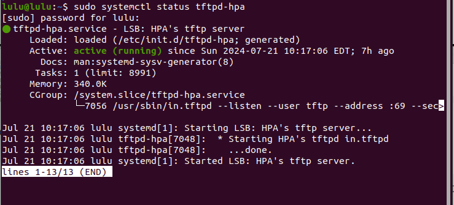

- check what is istalled with package
```sh 
dpkg -L tftpd-hpa
```
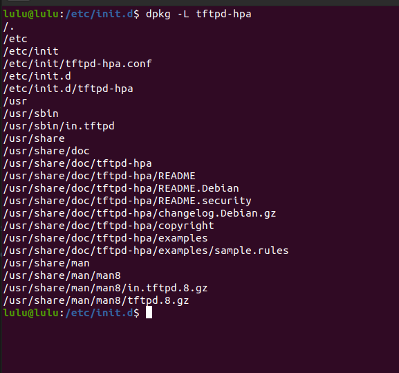

- check service directory created 
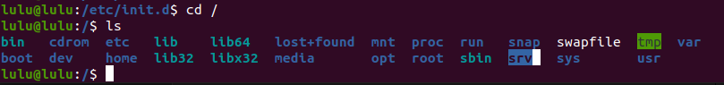

- that creat user in /etc/passwd 

    


2. change tftp configuration 
    - /etc/defualt/tftpd-hpa
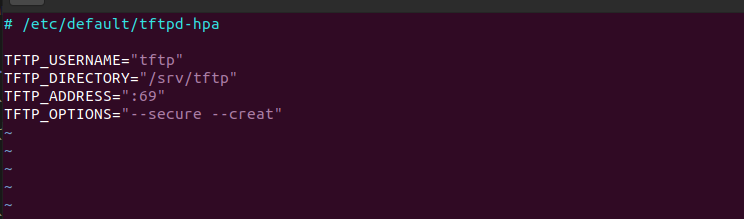
```sh
-- secure: read permision    
--creat: that i added to secure write permission
```

- TFTP script 
    - /etc/init.d/tftpd-hpa

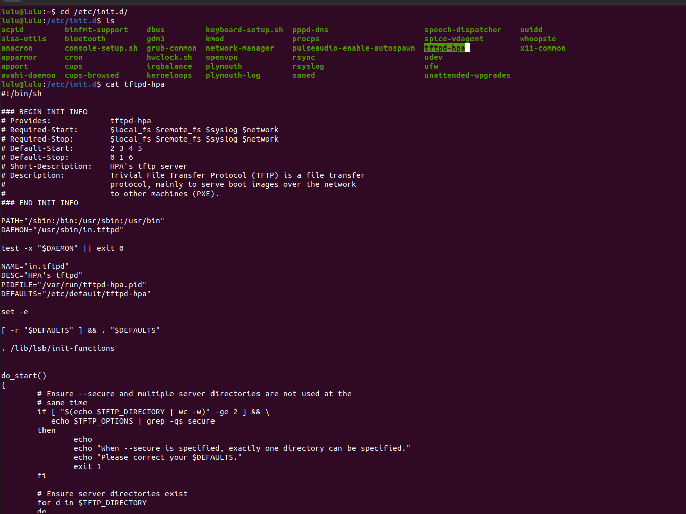
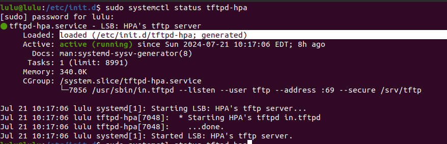

when run tftp it give options to script
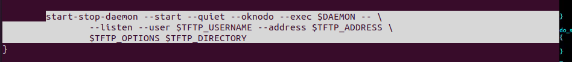
so, That's why we need configuration.

```sh 
man tftpd
```
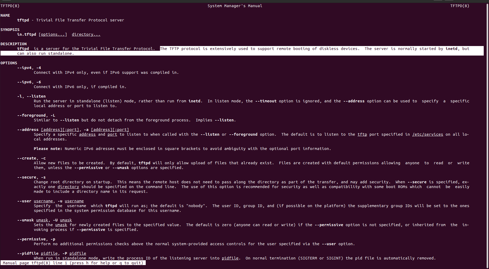
 
 make sure you restart the protocol after modify configuration
 ```sh 
systemctl restart tftpd-hpa.service 

 ```

3. change the owner to tftp(system user)
in /srv/tftp, should 
- have file that i want to load(zimage, vexpress-v2p-ca9.dtp)

- change the owner to tftp(system user)
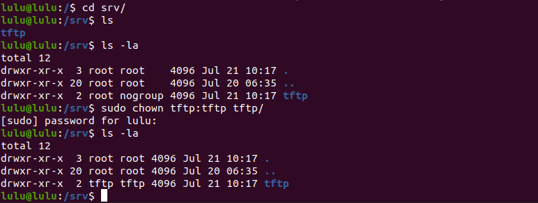


### U BOOT 

```sh 
 setenv ipaddr 192.168.100.2
 ping 192.168.100.1
 setenv serverip 192.168.100.1
 tftp $kernel_addr_r zimage
 tftp $fdt_addr_r vexpress-v2p-ca9.dtp
 md $fdt_addr_r
 md $kernel_addr_r
```
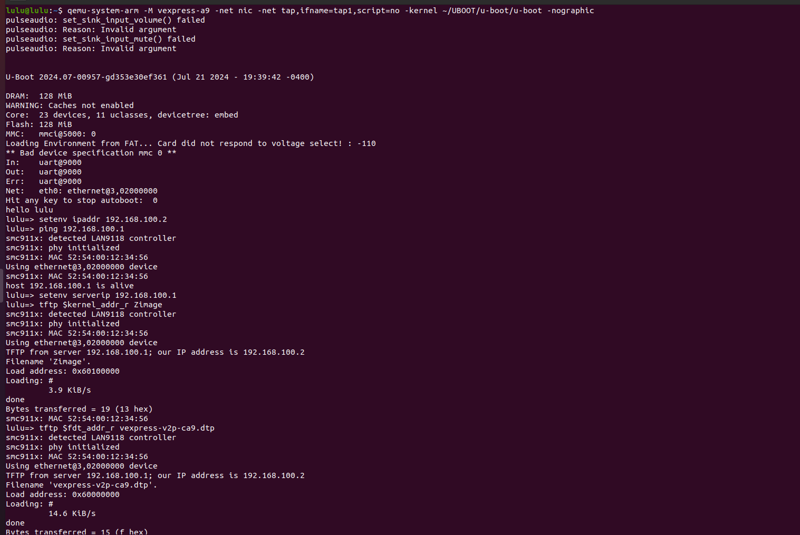
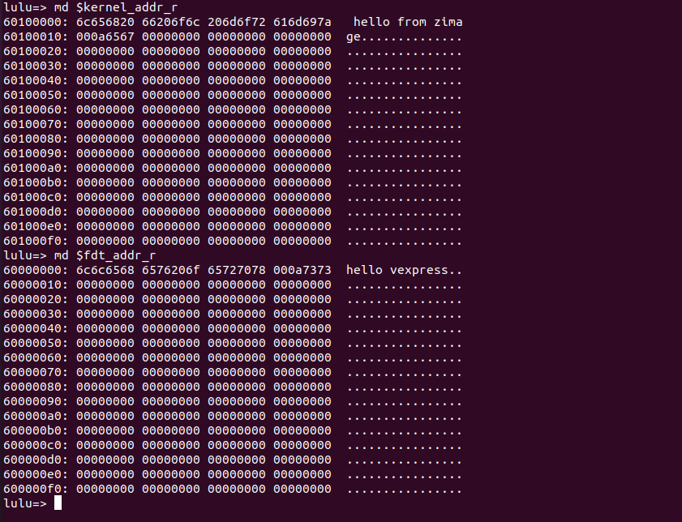

```sh 
 bootz $kernel_addr_r - $fdt_addr_r
 ```
 

```sh 
zimage: Bad magic!
```
- Incorrect Kernel Format
    - kernel image we are using is not appropriate for the architecture you are emulating in QEMU

## Please hang tight! We'll be back shortly to explain everything.
