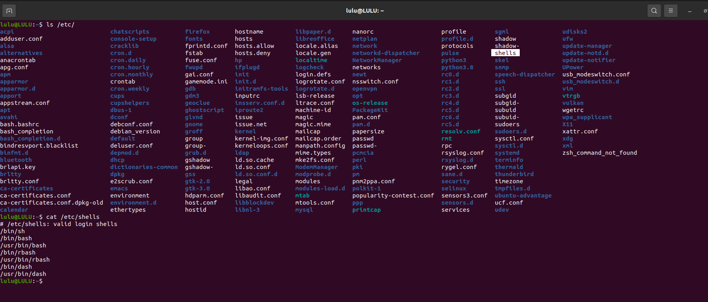
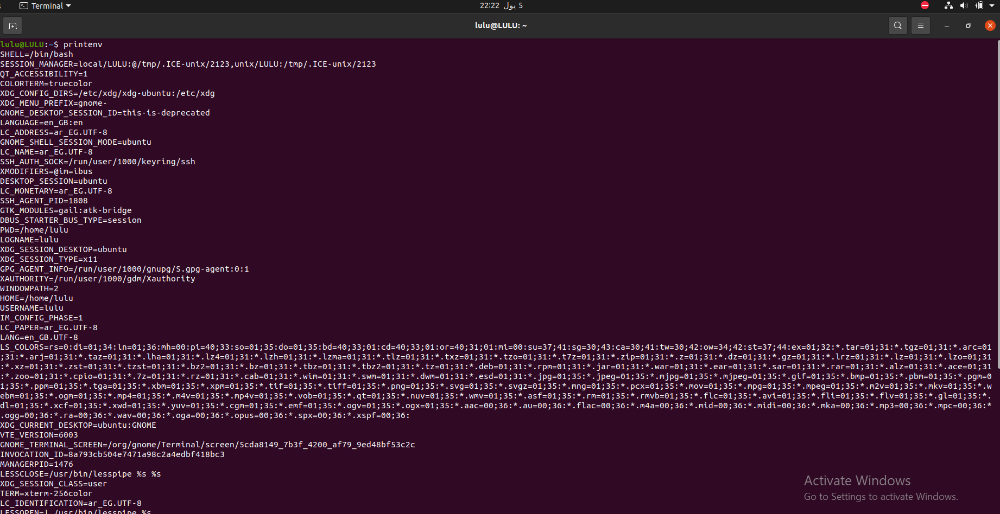
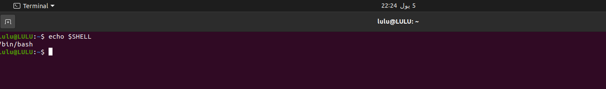
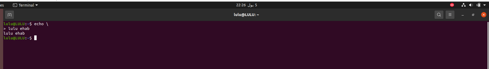
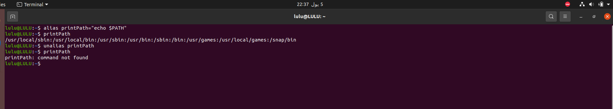

## 1. List the available shells in your system.
cat /etc/shells

## 2. List the environment variables in your current shell.
printenv

## 3. Display your current shell name.
echo $SHELL

## 4. Execute the following command :
echo \ then press enter 

What is the purpose of \ ?
- the backslash character (\) is used as an escape character
- When you execute the command echo \ followed by pressing Enter, the backslash serves a specific purpose:
     - indicates that the command continues on the next line, So in the new line you enter what you need to print.

## 5. Create a Bash shell alias named PrintPath for the “echo $PATH” command

alias printPath="echo $PATH"

- To delete the alias
    - unalias printPath 

