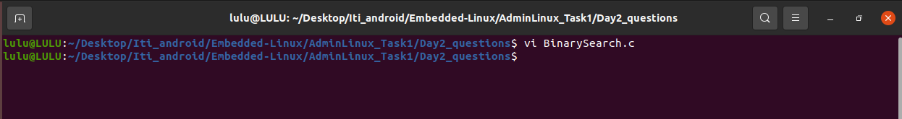
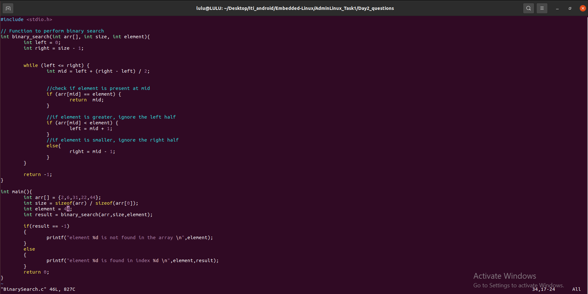
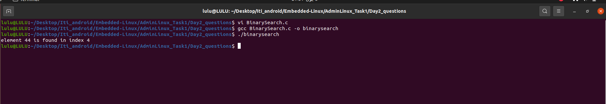
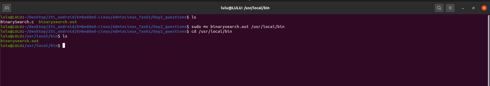
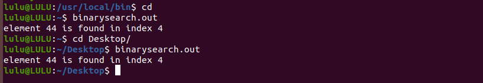
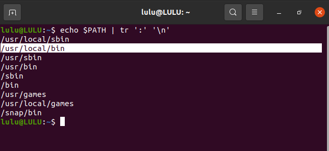

## Question 1: Using VI editor only!!!!
-  Implement the binary search algorithm inside the binary_search function. 
Ensure that it returns the index of the searched element or -1 if the element is 
not present.
- In the main function, declare an array and an element to search. Call the 
binary search function with appropriate arguments.
- Make sure to print the output of the search using printf()
- Compile and run your program to verify the correctness of your binary 
search implementation.

creat source file using vi

switch to insert mode by 'i' key,
write the code then, to save it use (Esc:wq)
- Esc key(to escape from insert mode) 
- :(to switch to command mode)
- wq(to save and quit)) 

- To Compile and run your program
gcc Binary_Search.c -o binarysearch
./binarysearch

## Question 2: 
Move the binary file output to the directory /usr/local/bin with sudo permissions.

Afterward, attempt to execute the binary from any working directory and explain the outcome. Provide a detailed explanation supported by evidence as to why the binary can be executed from any location.

When you move a binary file to /usr/local/bin, you make it available to be executed from anywhere on the system because /usr/local/bin is included in the system's PATH environment variable.

