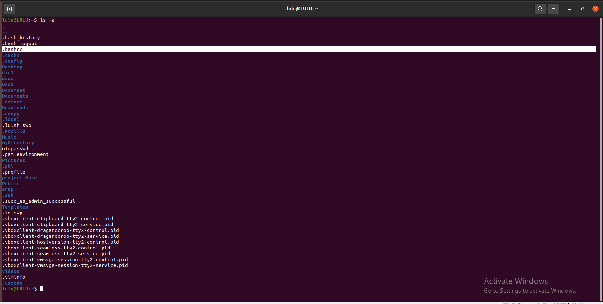

## Write a Bash script that checks IF the .bashrc file exists in the user's home directory. 
- If it does, append new environment variables to the file: one called HELLO with the value of HOSTNAME, and another local variable called LOCAL with the value of the whoami command. Additionally, the script should include a command to open another terminal at the end. 
- Describe what happens when the terminal is opened.

If the file exists, it appends two lines to the .bashrc file:

sets the HELLO environment variable to the value of the HOSTNAME environment variable.
sets the LOCAL environment variable to the result of the whoami command, (returns the current user's username)

What happens when the terminal is opened:

When the new terminal opened, it will execute .bashrc file. This means the HELLO and LOCAL environment variables will be set in the new terminal session.
test it by typing echo $HELLO and echo $LOCAL in the new terminal window.