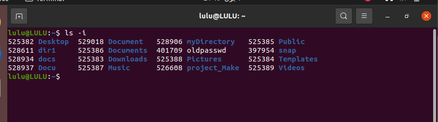

1. List the user commands and redirect the output to /tmp/commands.list 

list files in /usr/bin/ 

To redirect the output to /tmp/commands.list
- ls /usr/bin/ > /tmp/commands.list

- To make sure of the change
vim /tmp/commands.list

2. Edit in your profile to display date at login and 

write this command in  ~/.bashrc: echo "Login date and time: $(date)"

OR PS1='[\t ]\$ '

open a new terminal to execute .bashrc 

- To change your prompt permanently
export PS1="\u@\h:\w\$ "

- \u: Username of the current user.
- \h: Hostname up to the first ..
- \W: Basename of the current working directory.
- \$: Displays # for the root user and $ for normal users.

3. What is the command to count the word in a file or number of file in directory. 
- To count the number of words in a file, use the wc (word count) command

a. Count the number of user commands
 
 -  ls /usr/bin | wc -l
 

4. What happens if you execute: 
a. cat filename1 | cat filename2 
- it display only file2 content

b. ls | rm 
- ls list files and will be input to rm to remove all this files but doesn't work as expected because rm doesn't accept filenames via standard input.

c. ls /etc/passwd | wc –l 

- counts the number of lines in /etc/passwd

5. Write a command to search for all files on the system that, its name is “.profile”.

- find / -name .profile

6. List the inode numbers.

- ls -i  

7. Create a symbolic link of /etc/passwd in /boot.

- ln -s /etc/passwd /boot //need sudo: Run the command with superuser privileges (necessary because /boot is a system directory that requires elevated permissions).

8. Create a hard link of /etc/passwd in /boot. Could you? Why?

- ln /etc/passwd /boot //need sudo: Run the command with superuser privileges (necessary because /boot is a system directory that requires elevated permissions).

9. Echo \ it will jump to the next line, and will print >
Notice the prompt ”>” what is that? and how can you change it from “>” to “:”.

-  echo \, it causes the shell to prompt for additional input and take it in new line start with `>`
> : This indicates that the shell is waiting for the input to be entered.

- To change it from “>” to “:”.

write in .basrc
PS2=":" 

and open new terminal to execute new .bashrc

# NOTE: search the usage of PS1
- PS1 => "prompt string 1" 
default seting is: PS1='[\u@\h \W]\$ 

| sequense | description | 
| \u | current user name |
| \h | host name |
| \H | full host name |
| \w | Current working directory (full path) |
| \t| Current time in 24-hour HH:MM format |
| \T| Current time in 12-hour HH:MM format |
| \$| show # for root and $ for other|

- PS2: "prompt string 2"  
used when a command covers several lines.(default: >).
- PS3: "prompt string 3" 
Prompt used for the select command (default: #? ).
- PS4: "prompt string 4" 
Prompt used for debugging (default: +).