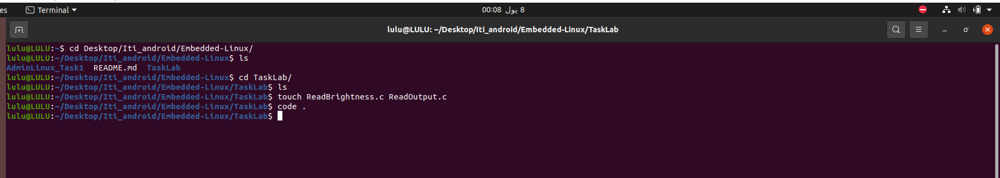
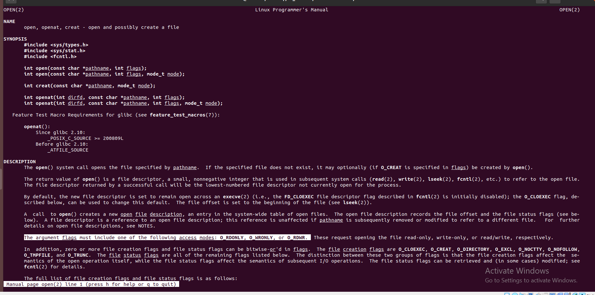
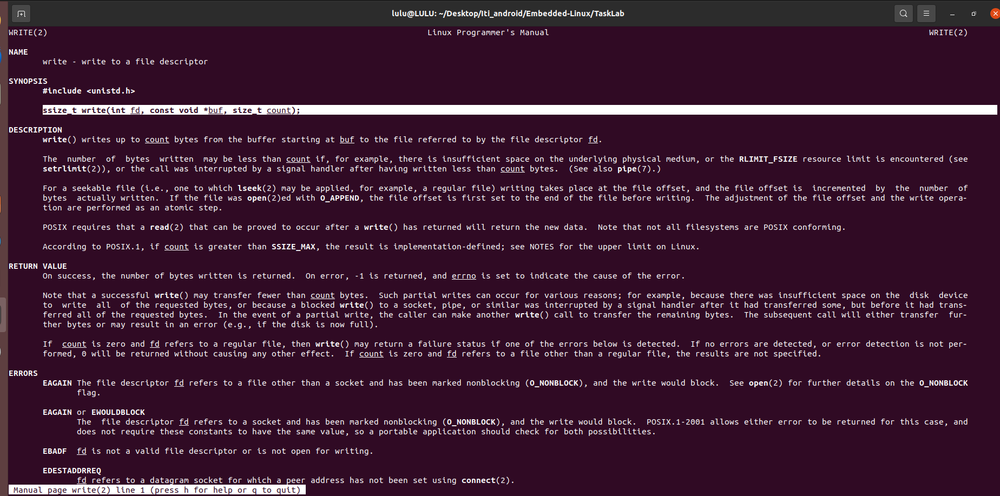
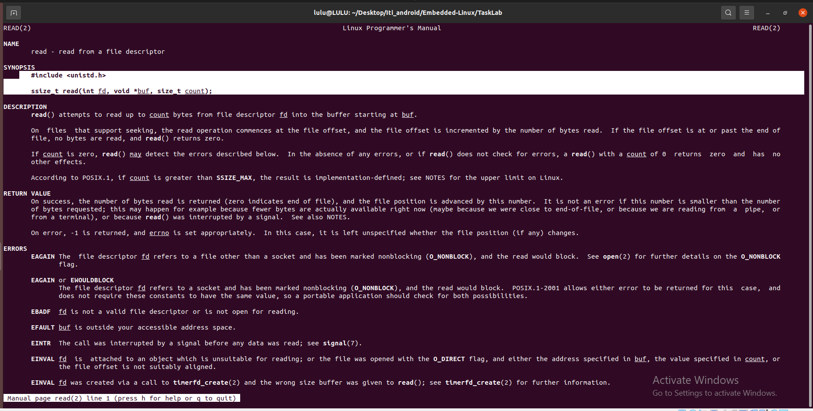
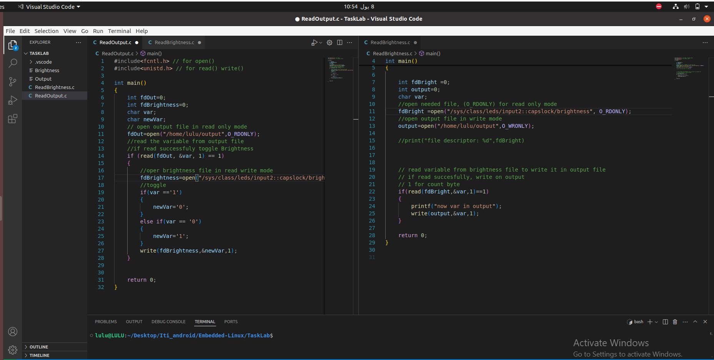
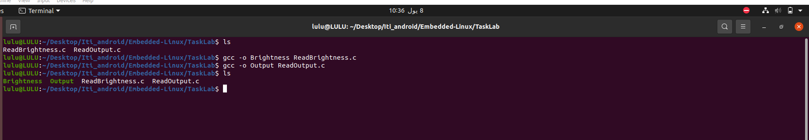
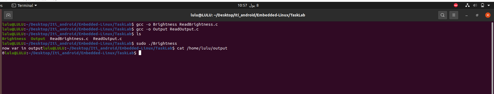

### c program one:

1- open file discripton on /sys/class/leds/input::capslock/brightness

2- read content inside the file and print it on file name (output) in home directory

### another c program:
read file output 
if(var == 1)
{
brightenss < 0
}
if(var == 0)
{
brightenss < 1
}
Hint: by piping command 

## STEPS:

1- Creat c files

2- To know how open file 
- man open
 open("/sys/class/leds/input::capslock/brightness", O_RDONLY);   

3- To know how write work
- man 2 write
write(output, &var, 1)

4- To know how read work
- man 2 read
###### Hint: here we can use fscanf(),
###### fscanf() and read() are both functions used to read data from files in C.

- fscanf(): High-level I/O function
- read(): Low-level I/O function

read(fdBrightness, &var, 1)

5- to know path of capslock Brightness file

6- Write programs

7- Compile programs

8- Run programs

- sudo ./Brightness
This command will read the current brightness value of the Caps Lock LED and write it to the file Output file.
- use cat to read output file

- sudo ./output

after that the capslock brightness led value will toggle 