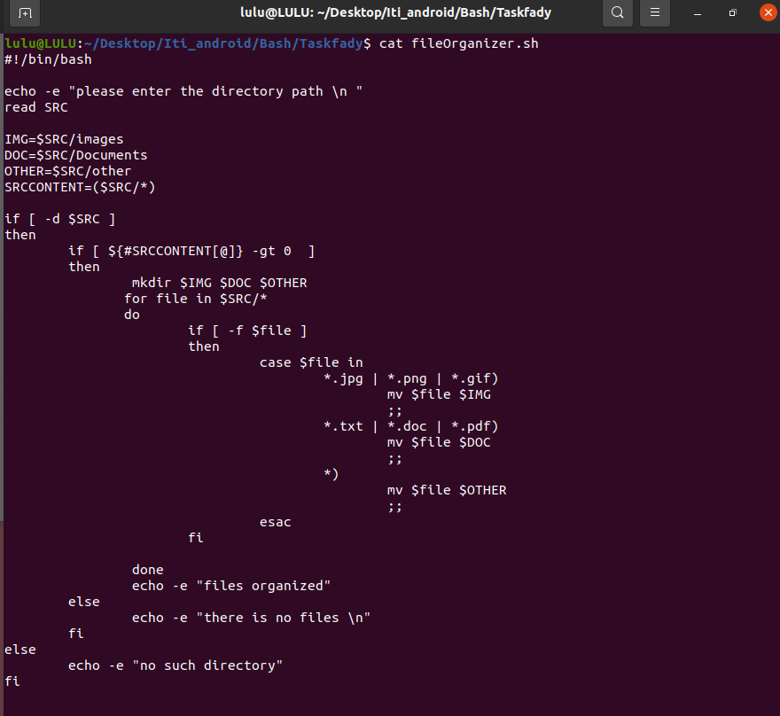
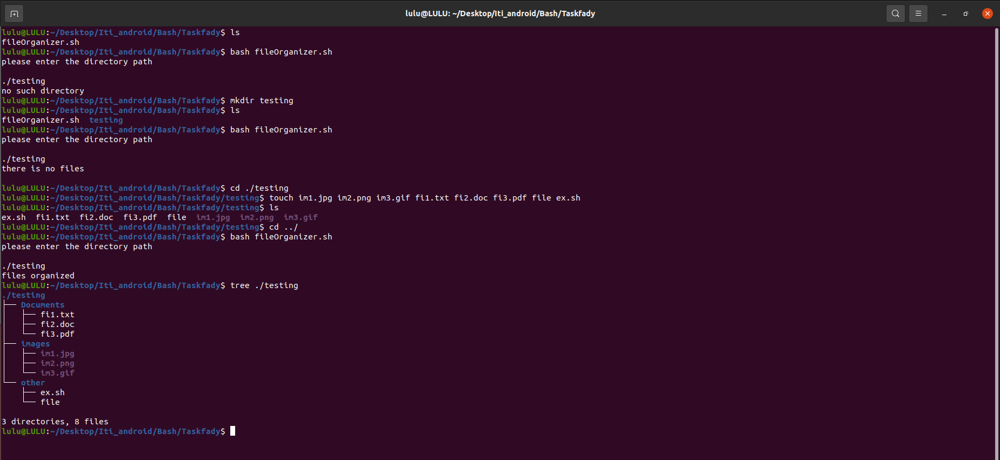

# Bash Scripting Task: File Organizer

Objective:
Create a Bash script that organizes files from a source directory into subdirectories 
based on their file types.
Requirements:
1. The script should accept a single argument which is the source directory 
containing the files to be organized.
2. It should create subdirectories (images, documents, others) within the source
directory.
3. Files should be categorized based on their types:
- Images: Files with extensions .jpg, .png, .gif
- Documents: Files with extensions .txt, .doc, .pdf
- Others: Files with any other extensions
4. Each file should be moved from the source directory to the appropriate 
subdirectory based on its type.
5. Ensure the script handles edge cases like files without extensions or unknown
file types appropriately

### STEPS

1- Take Source Directory as Argument:
    `read SRC`
2- Check if a source directory argument is existed:
    `if [ -d $SCR ]` //return true if $SCR is exist directory
3- Check if a source directory include files ar directory:
    `SRCCONTENT=($SRC/*)` //creat an array of source directory content
    `if [ ${#SRCCONTENT[@]} -gt 0]` //return true if number of element greater than 0
4- Create subdirectories images, documents, and others within the source directory if they do not already exist:
    `IMG="$SCR/images"`
    `DOC="$SCR/documents"`
    `OTHER="$SCR/other"`
    `mkdir $IMG $DOC $OTHER`

5- Categorize Files Based on Their Types Move Files to Appropriate Subdirectories Based on the determined category:
    `for file in $SRC/*`
    `do`
        `if [ -f $file ]`
        `then`
            `case $file in `
                `*.jpg | *.png | *.gif)`
                    `mv $file $IMG`
                    `;;`
                `*.txt | *.doc | *.pdf)`
                    `mv $file $DOC`
                    `;;`
                `*)`
                    `mv $file $OTHER`
                    `;;`
            `esac`
        `fi`
    `done`

6- execute file 
    `bash fileOrganizer`

