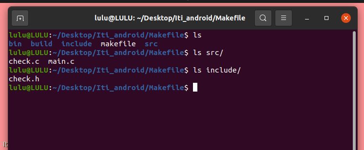
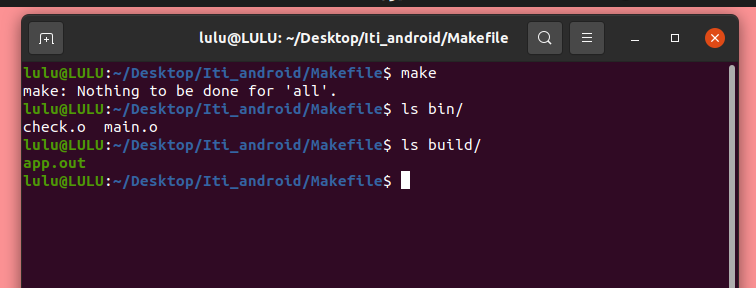
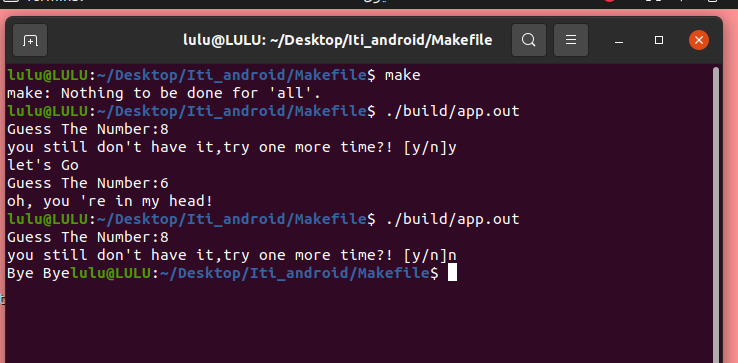

# Number Guessing Game

## Description
This is a simple number guessing game implemented in C. The program generates a random number, and the user must guess the number.

## Project directory structure:

- `src/`: Directory containing .c source files  
- `include/`: Directory containing .h header files 
- `bin/`: Directory to store compiled object files 
- `build/`: Directory to store the final executable (app).

## Compilation
- To compile the project, run the following command from the root directory:
- make
- the output files after compile

- To run the application, write the executable file path
- ./build/app.out

