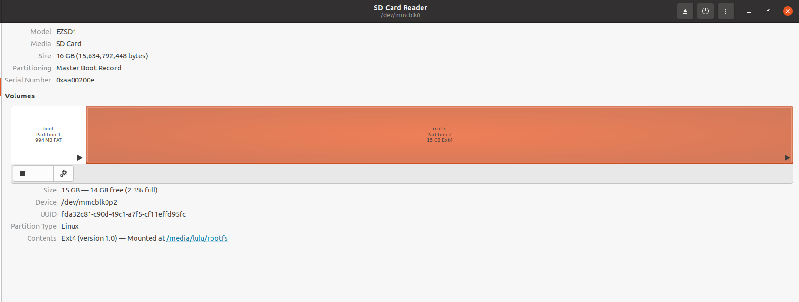
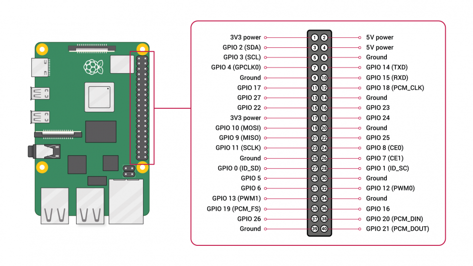
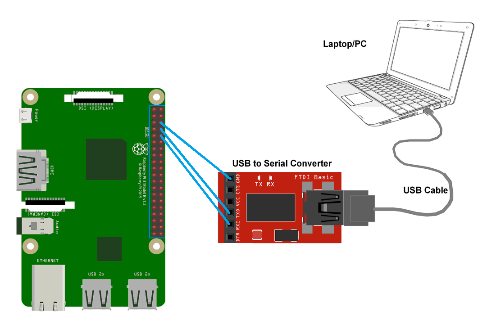
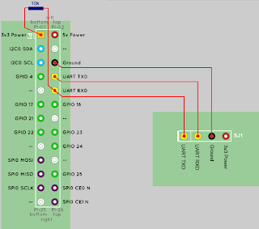
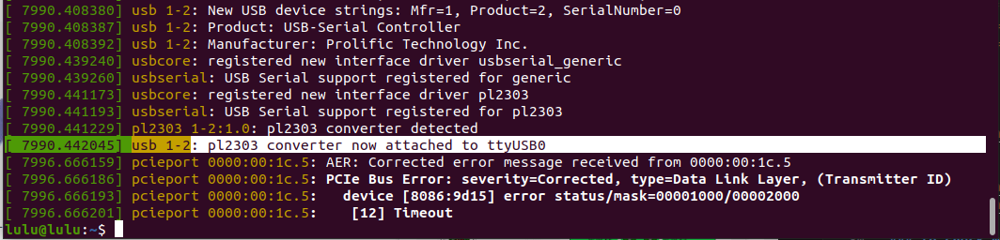
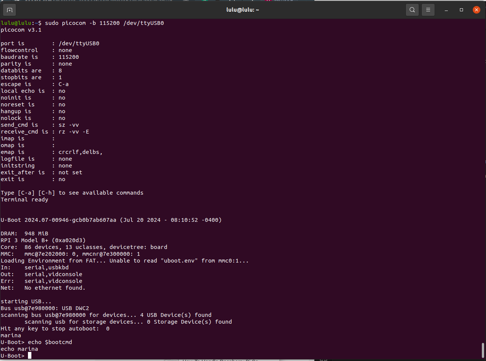

# The boot sequence of Raspberry Pi 3 Model B


# install GCC
```sh
sudo apt install gcc-arm-linux-gnueabihf

```
# git U_boot 

### git u-boot repo
```sh 
git clone git@github.com:u-boot/u-boot.git
cd u-boot/
```

### search for my target
```sh
ls config | grep rpi_3_32b_defconfig
export CROSS_COMPILE=arm-linux-gnueabihf-
export ARCH=arm
make rpi_3_32b_defconfig
make
```

# Download bootloader files 

[](https://github.com/raspberrypi/firmware)
- /boot/fixup.dat
- /boot/start.elf
- /boot/bootcode.bin
- /boot/bcm2710-rpi-3-b-plus.dtb


# Prepare SD card

### Create two partitions

- First partition is of size 1GB, type fat32 with label boot. 
- Second partition is of size is of remaining of the SD card storage with the type Linux(Ext4) with label rootfs.
- Mount them.



Once the SD card partitioning is done, copy mentioned files to boot partition of SD card.

- files you already downloded 
    - /boot/fixup.dat
    - /boot/start.elf
    - /boot/bootcode.bin
    - /boot/bcm2710-rpi-3-b-plus.dtb
- from Your U-Boot 
    - u-boot.bin

### create configration file 

```sh 
vim config.txt
```
```sh 
kernel=u-boot.bin
enable_uart=1
device_tree=bcm2710-rpi-3-b-plus.dtb
```

- kernel=u-boot.bin => As of now, we have yet to acquire a kernel, necessitating the loading of U-Boot in lieu of the kernel.
- enable_uart=1  => enable uart to ttl(USB to serial converter)
- device_tree=bcm2710-rpi-3-b-plus.dtb => addresses of our spicific hardware 


# connection 


- TXD and RXD ports correspond to physical ports 8 and 10.
- Connect TXD,RXD,comman GND.



### to check messages from kernel 
```sh 
sudo dmesg
```

after connected ttl

### Minicom

- Minicom is a terminal emulator program for Unix-like operating systems, typically used for serial communication. It allows you to connect to and interact with devices that communicate over serial ports, such as routers, switches, and other embedded systems.

```sh 
sudo apt install  minicom
sudo minicom -D /dev/ttyUSB0
```
OR
```sh 
sudo apt install  picocom
sudo picocom -b 115200 /dev/ttyUSB0
```
- Minicom and Picocom are both terminal emulator programs
- Interacting with U-Boot on Raspberry Pi 3...

